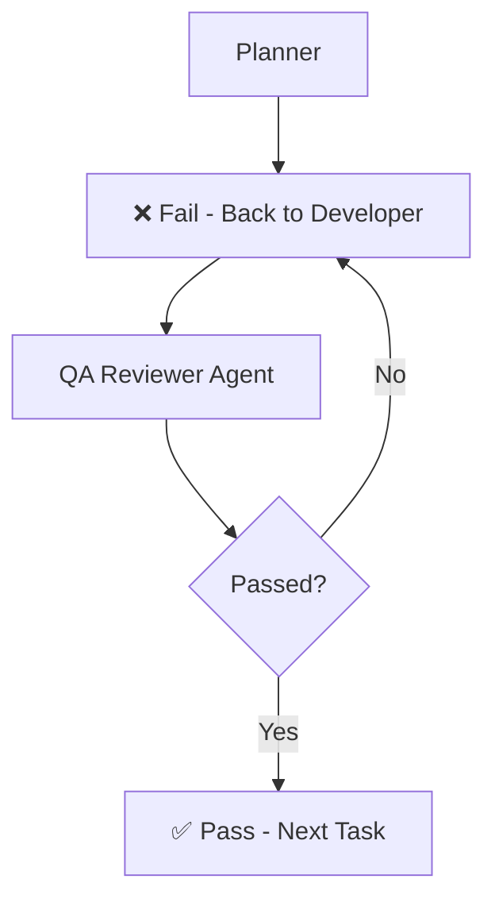

# Agent Workflow and Rules

## Workflow

## Rules
- **Rule**: After completing every task, the Developer must invoke the QA Reviewer.
- **Rule**: No task may be marked complete until the QA Reviewer returns PASS.
- **Rule**: If FAIL is returned, the Developer must fix all issues and repeat the review.
