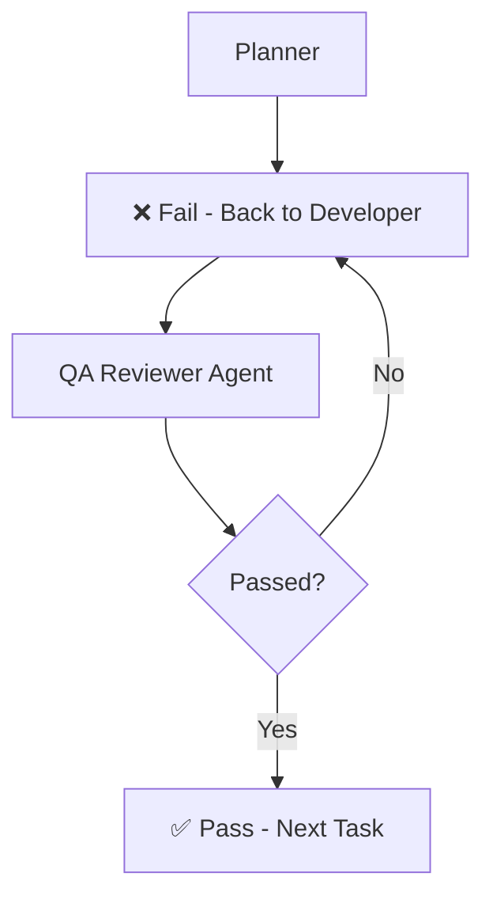

# Agent Workflow and Rules

## Workflow

## Rules
- **Rule**: After completing every task, the Developer must invoke the QA Reviewer.
- **Rule**: No task may be marked complete until the QA Reviewer returns PASS.
- **Rule**: If FAIL is returned, the Developer must fix all issues and repeat the review.
- **Rule**: All requests from Vercel must go directly to Supabase. All website data must be stored in Supabase, and updated only from Hugging Face via the daily automated jobs.
- **Rule**: Never push/upload any changes to GitHub unless the user explicitly requests it.
- **Rule**: Whenever performing a rebuild, cache cleanup, or stopping local dev processes, ALWAYS automatically restart both local servers (Python FastAPI backend on port 8000 and Next.js frontend on port 3000) if they were running previously, without waiting for the user to request it.
