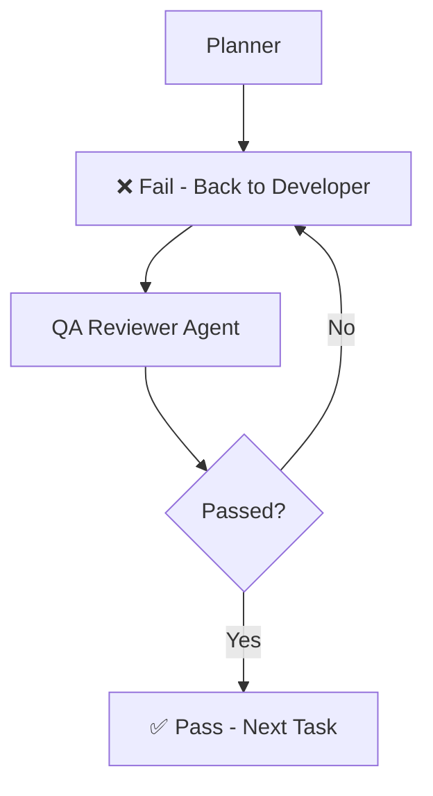

# Agent Workflow and Rules

## Workflow

```mermaid
graph TD
    Planner --> DeveloperAgent[Developer Agent]
    DeveloperAgent --> QAReviewer[QA Reviewer Agent]
    QAReviewer --> Check{Passed?}
    Check -- Yes --> NextTask[✅ Pass - Next Task]
    Check -- No --> DeveloperAgent[❌ Fail - Back to Developer]
```

## Core Agent Rules
- **Rule**: After completing every task, the Developer must invoke the QA Reviewer.
- **Rule**: No task may be marked complete until the QA Reviewer returns PASS.
- **Rule**: If FAIL is returned, the Developer must fix all issues and repeat the review.

## 🛑 Strict Resource Guard & Supabase Log Waste Prevention
All agents (Planners, Developers, QA Reviewers, Subagents, and AI tools) must strictly adhere to these rules:

1. **NO Broad Supabase Log Queries (Zero Log Query Waste)**:
   - **NEVER** use Supabase MCP tools (`query_logs`), Management API, or CLI to read remote logs during routine reviews, feature verification, healthy monitoring, or normal debugging.
   - Supabase `Log Query` usage measures the uncompressed gigabytes *scanned* in BigQuery/Logflare. A single broad scan burns 5–10 GB of the monthly allowance!
   - Always check application state and database tables directly instead of logs:
     * Check daily bot job status via `daily_job_runs` table with `.limit(1)` and targeted fields (`status, finished_at, error`).
     * Check Hugging Face / API status via local endpoint responses (`/api/health`) or local file logs in `logs/structured.json`.
     * Check error causes from thrown exceptions, stack traces, and local test runners, never from cloud log queries.

2. **Emergency-Only Log Inspection Protocol**:
   - If querying remote logs is strictly unavoidable (e.g. fatal unhandled edge function crash with no local trace):
     * Time window MUST be strictly limited to a maximum of 15 minutes around the event (`iso_timestamp_start`, `iso_timestamp_end`).
     * Must target the exact single service (e.g. `edge-runtime` or `postgres`), never all services.
     * The result MUST be cached in memory or a scratch file; **NEVER** re-query the same timeframe.

3. **Database Query Economy**:
   - Never run `SELECT *` on high-volume tables (`stock_prices`, `scan_results`, `stock_technical_indicators`). Always specify exact columns and strict `LIMIT` clauses.
   - Never write scripts or background tasks that poll Supabase in tight loops (`while True: fetch(); sleep()`).
   - Use deterministic offline unit tests and fixtures before invoking any live services or remote tools.

4. **Frontend & Polling Guard**:
   - Do not add rapid client-side network polling intervals (`setInterval < 30s`) in UI components.
   - Rely on Vercel Data Cache, SWR revalidation on focus/action, and event-driven updates.
