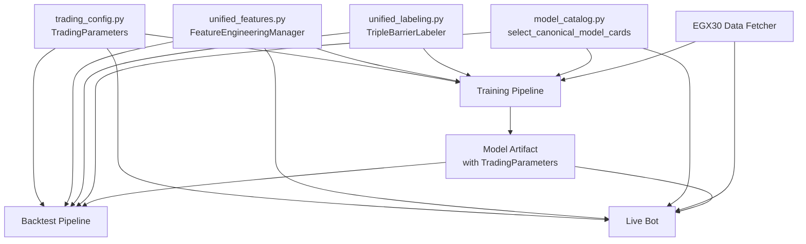

# Design Document: EGX Unified Trading System

## Overview

The EGX Unified Trading System integrates consistent trading logic across Training, Backtesting, and Live Bot pipelines while adding Egyptian Exchange (EGX)-specific enhancements. This design addresses three critical problems:

1. **Inconsistency Across Pipelines**: Currently, training labels use different entry logic than live bot execution, creating a train-test mismatch that inflates paper metrics and disappoints in production
2. **Market-Agnostic Design**: The system treats Egyptian stocks like US equities, ignoring thin liquidity, circuit breakers, macro sensitivity, and sector concentration
3. **Overfitting Risk**: Random train/test splits leak future information into training, making validation metrics unrealistically optimistic

### Design Goals

- **Unified Logic**: Entry price, barrier calculations, volume confirmation, and model selection use identical code across all three pipelines
- **EGX Awareness**: Market context (EGX30 regime), volume thresholds, circuit breaker detection, and quality-focused labeling
- **Realistic Validation**: Walk-forward time-series validation that strictly prevents lookahead bias
- **Maintainability**: Centralized configuration through `TradingParameters` dataclass, eliminating scattered magic numbers
- **Extensibility**: Clear roadmap for Phase 2-4 enhancements (macro features, paper trading, SaaS launch)

### Architecture Philosophy

The unified files (`trading_config.py`, `unified_features.py`, `unified_labeling.py`, `model_catalog.py`) act as **contracts** between components. Changes to trading logic require modification in only one place, automatically propagating to all consumers. This design prevents drift and ensures that "what you train is what you trade."

## Architecture

### System Components




### Data Flow

1. **Training Phase**:
   - Load historical OHLCV data + EGX30 index
   - Apply `FeatureEngineeringManager.check_data_ready()` to validate completeness
   - Use `TripleBarrierLabeler.label_training_data()` to generate `Target` column
   - Train model with walk-forward validation
   - Save `TradingParameters` in model artifact metadata
   - Use `model_catalog.select_canonical_model_cards()` to identify KING and THE BRAIN

2. **Backtesting Phase**:
   - Load model artifact and extract `TradingParameters`
   - Validate data with same `FeatureEngineeringManager`
   - Simulate trades using `TripleBarrierLabeler.backtest_trade()`
   - Compare outcomes to training labels (should match within tolerance)
   - Report discrepancies if P&L differs by >1%

3. **Live Bot Phase**:
   - Load model and `TradingParameters` from artifact
   - Fetch live market data via Binance/TradingView
   - Validate with `FeatureEngineeringManager` before prediction
   - Apply `king_threshold` and `council_threshold` from `TradingParameters`
   - Check EGX30 regime, volume confirmation, circuit breaker status
   - Execute trade if all filters pass

### Integration Points

**Training Pipeline** (`train_exchange_model.py`):
- Replace legacy barrier calculation with `TradingParameters`
- Use `unified_labeling.label_training_data()` for label generation
- Implement walk-forward validation splits
- Save `TradingParameters.to_dict()` in model artifact

**Backtest Pipeline** (`backtest_radar.py`, `backtest_optimizer.py`):
- Load `TradingParameters.from_model_artifact()`
- Use `unified_labeling.backtest_trade()` for outcome simulation
- Report parameter consistency checks

**Live Bot** (`live_bot.py`):
- Load `TradingParameters` at startup
- Validate compatibility with model artifact
- Apply EGX30 regime filter, volume confirmation, circuit breaker detection


## Components and Interfaces

### 1. TradingParameters (trading_config.py)

**Purpose**: Unified configuration for all trading logic.

**Status**: Already implemented with comprehensive features.

**Key Attributes**:
```python
@dataclass
class TradingParameters:
    # Entry Logic
    entry_mode: str = "next_open"  # Prevents lookahead bias
    entry_buffer_pct: float = 0.001  # Slippage assumption
    
    # Barrier Mode
    barrier_mode: str = "percent"  # "percent" | "atr_multiplier"
    target_pct: float = 0.10
    stop_loss_pct: float = 0.05
    look_forward_days: int = 20
    
    # Volume Confirmation (EGX specific)
    require_volume_confirmation: bool = False
    min_volume_ratio: float = 0.3
    
    # Model Thresholds
    king_threshold: float = 0.50
    council_threshold: float = 0.50
    validator_threshold: float = 0.50
    
    # Feature Engineering
    min_history_needed: int = 100
    warmup_bars: int = 100
    feature_lookback: int = 252
```

**Interface Methods**:
- `from_model_artifact(artifact: Dict)` → `TradingParameters`: Extract from model metadata
- `from_config_file(path: str, profile: ConfigProfile)` → `TradingParameters`: Load from JSON/YAML
- `from_environment(prefix: str)` → `TradingParameters`: Load from env vars
- `from_multiple_sources(...)` → `TradingParameters`: Merge with priority order
- `to_dict()` → `Dict`: Serialize for model artifact
- `validate_for_market(market: str)` → `Dict[str, List[str]]`: Market-specific validation

**Design Decision**: Use dataclass for type safety and immutability. Validation in `_validate()` catches configuration errors early.


### 2. FeatureEngineeringManager (unified_features.py)

**Purpose**: Consistent feature validation and data readiness checks.

**Status**: Already implemented.

**Key Methods**:
```python
class FeatureEngineeringManager:
    def check_data_ready(bars: pd.DataFrame) -> DataReadinessReport:
        """
        Validates:
        - Minimum bars (min_history_needed)
        - NaN percentage < 5%
        - Required OHLCV columns present
        - Price sanity (high >= low, positive prices)
        - Volume quality
        """
    
    def get_warmup_skip() -> int:
        """Number of bars to skip at start due to indicator warmup"""
    
    def validate_features(X: pd.DataFrame, expected: List[str]) -> Tuple[bool, List[str], Dict]:
        """Check feature presence, NaN counts, infinite values"""
    
    def detect_feature_drift(X_train, X_live, threshold=0.1) -> Dict:
        """Warn if live feature distributions differ from training"""
    
    def check_data_leakage(df, label_col="Target") -> Tuple[bool, List[str]]:
        """Detect lookahead bias, perfect correlations, time ordering issues"""
```

**Interface with TradingParameters**:
- `min_history_needed`: Minimum bars before prediction allowed
- `warmup_bars`: Bars to skip at start for indicator stability
- `feature_lookback`: Longest indicator window (e.g., 252-day MA)

**Design Decision**: Fail fast with detailed error messages. Return structured reports for logging and debugging.


### 3. TripleBarrierLabeler (unified_labeling.py)

**Purpose**: Consistent labeling logic for training and backtest outcome simulation.

**Status**: Already implemented.

**Key Methods**:
```python
class TripleBarrierLabeler:
    def calculate_barriers(entry_price: float, atr: float) -> Tuple[float, float]:
        """Calculate TP and SL based on barrier_mode (percent or atr_multiplier)"""
    
    def label_single_trade(
        entry_idx: int,
        high_window: np.ndarray,
        low_window: np.ndarray,
        volume_window: np.ndarray,
        volume_ma_20: float
    ) -> int:
        """
        Returns 1 if TP hit before SL and volume confirmed
        Returns 0 if SL hit first, neither hit, or volume failed
        """
    
    def backtest_trade(
        entry_price: float,
        atr: float,
        bars_ahead: List[Dict],
        max_bars: int
    ) -> TradeOutcome:
        """
        Simulates trade execution bar-by-bar
        Returns outcome: "TP_HIT" | "SL_HIT" | "TIMEOUT"
        """
    
    def label_training_data(df: pd.DataFrame) -> pd.DataFrame:
        """Applies labeling to full historical dataset, returns df with Target column"""
```

**Triple Barrier Logic**:
1. Entry at `next_open` (prevents lookahead bias)
2. Calculate TP = entry * (1 + target_pct) and SL = entry * (1 - stop_loss_pct)
3. Scan forward `look_forward_days` bars
4. If TP touched first → check volume confirmation → label = 1
5. If SL touched first or volume failed → label = 0
6. If neither touched → label = 0

**Design Decision**: Use vectorized NumPy operations for speed. Cache calculated barriers to avoid recomputation.


### 4. Model Catalog (model_catalog.py)

**Purpose**: Canonical model selection across all pipelines.

**Status**: Already implemented.

**Function**:
```python
def select_canonical_model_cards(models: List[Dict]) -> List[Dict]:
    """
    Returns at most 2 models: KING and THE BRAIN (or NANO)
    
    Filters out:
    - KING-F variants (KINGF091, etc.)
    - Council, Validator, Advisor models
    
    Selection logic:
    - Prefers exact name matches ("KING 👑.pkl", "THE BRAIN.pkl")
    - Falls back to largest/longest named model
    """
```

**Design Decision**: Centralize model selection to prevent training from using different models than production. Explicit filtering rules prevent accidental ensemble contamination.

### 5. EGX30 Data Fetcher (New Component)

**Purpose**: Provide market context for filtering individual stock signals.

**Interface**:
```python
class EGX30Fetcher:
    def fetch_daily_ohlcv(start_date: str, end_date: str) -> pd.DataFrame:
        """Download EGX30 index data from Yahoo Finance or Supabase"""
    
    def calculate_daily_return() -> pd.Series:
        """Returns (close - prev_close) / prev_close"""
    
    def classify_market_regime(egx30_return: float) -> str:
        """
        Returns:
        - "panic" if return < -2%
        - "trending_up" if return > 1%
        - "trending_down" if return < -0.5%
        - "sideways" otherwise
        """
    
    def get_latest_regime() -> str:
        """Query most recent market regime for live bot filtering"""
```

**Storage**: Store in existing `stock_prices` table with symbol="^EGX30" or create dedicated `market_indices` table.

**Design Decision**: Separate fetcher allows multiple data sources (Yahoo, CSV, Supabase) with fallback logic.


### 6. Circuit Breaker Detector (New Component)

**Purpose**: Avoid trading stocks under exchange-imposed trading halts.

**Interface**:
```python
class CircuitBreakerDetector:
    def detect_from_ohlcv(df: pd.DataFrame) -> pd.Series:
        """
        Returns boolean series marking circuit breaker bars
        
        Detection logic:
        - high == low (zero range)
        - OR (high - low) / close < 0.001 (0.1% range)
        """
    
    def is_active(symbol: str, date: datetime) -> bool:
        """Check if circuit breaker active for symbol on date"""
    
    def log_event(symbol: str, date: datetime, price: float):
        """Record circuit breaker event for analysis"""
```

**Design Decision**: Simple heuristic (zero range) catches most cases. Can be enhanced later with exchange API integration.

### 7. Parameter Validator (New Component)

**Purpose**: Ensure training and live bot use compatible configurations.

**Function**:
```python
def validate_unified_parameters(
    training_params: TradingParameters,
    live_bot_config: Dict[str, Any]
) -> Tuple[bool, List[str]]:
    """
    Compare critical parameters:
    - barrier_mode
    - target_pct
    - stop_loss_pct
    - look_forward_days
    - king_threshold
    
    Returns:
    - (True, []) if compatible
    - (False, ["mismatch1", "mismatch2"]) if incompatible
    """
```

**Usage**: Call at bot startup. Log warnings if mismatches found. Optionally refuse to start if critical parameters differ.


## Data Models

### TradingParameters Schema

```python
{
    "entry_mode": "next_open",  # str
    "entry_buffer_pct": 0.001,  # float
    "look_forward_days": 20,  # int
    "look_forward_mode": "fixed",  # str
    "barrier_mode": "percent",  # str
    "target_pct": 0.10,  # float
    "stop_loss_pct": 0.05,  # float
    "require_volume_confirmation": false,  # bool
    "min_volume_ratio": 0.3,  # float
    "volume_confirmation_period": 5,  # int
    "king_threshold": 0.50,  # float
    "council_threshold": 0.50,  # float
    "validator_threshold": 0.50,  # float
    "min_history_needed": 100,  # int
    "warmup_bars": 100,  # int
    "feature_lookback": 252,  # int
    "max_consecutive_losses": 5,  # int
    "daily_loss_limit": 1000.0  # float
}
```

### Model Artifact Schema (Enhanced)

```python
{
    "model_name": "KING 👑.pkl",
    "trained_at": "2025-01-28T10:30:00Z",
    "exchange": "EGX",
    
    # New: Unified trading parameters section
    "trading_parameters": {
        "entry_mode": "next_open",
        "barrier_mode": "percent",
        "target_pct": 0.10,
        "stop_loss_pct": 0.05,
        "look_forward_days": 20,
        "require_volume_confirmation": true,
        "min_volume_ratio": 0.3
    },
    
    # New: Thresholds section
    "thresholds": {
        "king_threshold": 0.50,
        "council_threshold": 0.50,
        "validator_threshold": 0.50
    },
    
    # New: Feature requirements section
    "feature_requirements": {
        "min_history_needed": 100,
        "warmup_bars": 100,
        "feature_lookback": 252
    },
    
    # Existing sections
    "performance": {
        "precision": 0.58,
        "recall": 0.42,
        "f1": 0.49,
        "roc_auc": 0.65
    },
    
    "validation": {
        "method": "walk_forward",
        "splits": [
            {"train": "2019-2021", "test": "2022", "precision": 0.56},
            {"train": "2019-2022", "test": "2023", "precision": 0.60},
            {"train": "2019-2023", "test": "2024", "precision": 0.58}
        ]
    }
}
```


### DataReadinessReport Schema

```python
{
    "is_ready": true,  # bool
    "bars_count": 250,  # int
    "min_bars_required": 100,  # int
    "nan_percentage": 0.02,  # float (2%)
    "max_nan_acceptable": 0.05,  # float (5%)
    "missing_columns": [],  # List[str]
    "warnings": [  # List[str]
        "15 bars have zero volume"
    ]
}
```

### TradeOutcome Schema

```python
{
    "outcome": "TP_HIT",  # str: "TP_HIT" | "SL_HIT" | "TIMEOUT" | "HOLD"
    "exit_price": 105.50,  # float
    "exit_bars": 8,  # int (bars until exit)
    "pnl_pct": 9.8,  # float (percent)
    "exit_reason": "Take profit hit"  # str
}
```

### EGX30 Market Context Schema

```python
{
    "date": "2025-01-28",
    "egx30_close": 25800.50,
    "egx30_daily_return": -0.025,  # -2.5%
    "regime": "panic",  # str: "panic" | "trending_up" | "trending_down" | "sideways"
    "reject_buys": true  # bool
}
```

### Circuit Breaker Event Schema

```python
{
    "symbol": "COMI.CA",
    "date": "2025-01-28",
    "close": 10.50,
    "high": 10.50,
    "low": 10.50,
    "range_pct": 0.0,
    "is_active": true
}
```


## Error Handling

### 1. Configuration Validation Errors

**Scenario**: Invalid TradingParameters (e.g., target_pct > 1.0 in percent mode, negative thresholds)

**Handling**:
- `TradingParameters._validate()` raises `ValueError` with detailed multi-line error message
- List all validation failures (not just first one)
- Fail fast at initialization, not during training

**Example**:
```python
try:
    params = TradingParameters(target_pct=1.5, barrier_mode="percent")
except ValueError as e:
    logger.error(f"Invalid trading parameters:\n{e}")
    # Abort training/bot startup
```

### 2. Model Artifact Format Errors

**Scenario**: Model artifact missing required sections or has wrong structure

**Handling**:
- `TradingParameters.from_model_artifact()` catches `KeyError`, `ValueError`
- Logs warning and returns default parameters
- Allows graceful degradation (use defaults) rather than hard failure

**Rationale**: Old models may not have new unified sections. Prefer backward compatibility.

### 3. Data Quality Errors

**Scenario**: Insufficient data, too many NaNs, missing columns

**Handling**:
- `FeatureEngineeringManager.check_data_ready()` returns `DataReadinessReport` with `is_ready=False`
- Training pipeline logs report summary and skips symbol
- Live bot logs warning and skips prediction cycle

**Example**:
```python
report = fem.check_data_ready(bars)
if not report.is_ready:
    logger.warning(f"Data not ready for {symbol}:\n{report.summary()}")
    return None  # Skip this symbol
```


### 4. Parameter Mismatch Errors

**Scenario**: Training used `barrier_mode="percent"` but live bot uses `barrier_mode="atr_multiplier"`

**Handling**:
- `validate_unified_parameters()` returns `(False, ["barrier_mode mismatch: ..."])`
- Live bot logs **CRITICAL** warning at startup
- Optional: Refuse to start if `STRICT_VALIDATION=true` env var set

**Example**:
```python
is_compatible, mismatches = validate_unified_parameters(training_params, bot_config)
if not is_compatible:
    logger.critical(f"Parameter mismatch detected:\n" + "\n".join(mismatches))
    if os.getenv("STRICT_VALIDATION") == "true":
        raise RuntimeError("Aborting due to parameter mismatch")
```

### 5. EGX30 Data Fetch Errors

**Scenario**: EGX30 data unavailable (API down, network error, data gap)

**Handling**:
- `EGX30Fetcher.fetch_daily_ohlcv()` catches exceptions, logs error
- Falls back to last known regime (stored in cache)
- If no cache, defaults to "sideways" (neutral, allows trading)

**Rationale**: Prefer degraded service over complete failure. Market context is helpful but not critical.

### 6. Circuit Breaker Detection Edge Cases

**Scenario**: Stock has legitimate zero range (e.g., very illiquid penny stock)

**Handling**:
- `CircuitBreakerDetector` uses conservative threshold (0.1% range)
- Logs suspected circuit breakers for manual review
- Does not reject trades automatically unless confidence is high

**False Positive Mitigation**: Require consecutive days of zero range to confirm circuit breaker.

### 7. Walk-Forward Validation Errors

**Scenario**: Insufficient data for time-based split (e.g., only 1 year of data)

**Handling**:
- Training pipeline checks total date range before splits
- Logs warning if walk-forward impossible (< 3 years data)
- Falls back to single train/test split with 80/20 ratio
- Clearly marks validation method in model artifact


### 8. Labeling Edge Cases

**Scenario**: Look-forward window extends beyond available data

**Handling**:
- `TripleBarrierLabeler.label_training_data()` excludes last `look_forward_days` rows
- Sets `drop_labels=True` by default
- Warns if more than 10% of rows dropped due to insufficient forward data

### 9. Volume Confirmation Data Missing

**Scenario**: Volume column not present in DataFrame

**Handling**:
- `TripleBarrierLabeler.label_single_trade()` checks if `volume_window is None`
- If missing and `require_volume_confirmation=True`, accepts trade as valid (fail open)
- Logs warning: "Volume confirmation requested but data unavailable"

**Rationale**: Prefer false positives over false negatives when data incomplete.

### 10. Feature Drift Alerts

**Scenario**: Live feature distributions differ significantly from training (mean drift > 20%)

**Handling**:
- `FeatureEngineeringManager.detect_feature_drift()` returns dict with drift metrics
- Live bot logs drift report daily
- If max_drift > 30%, logs CRITICAL alert suggesting retraining

**Example**:
```python
drift_report = fem.detect_feature_drift(X_train, X_live, threshold=0.1)
high_drift = {k: v for k, v in drift_report.items() if v["alert"]}
if high_drift:
    logger.warning(f"Feature drift detected: {list(high_drift.keys())}")
```


## Testing Strategy

### Overview

This feature involves infrastructure integration, configuration management, and data pipeline refactoring. **Property-based testing is NOT applicable** because:
- No pure functions with universal properties to test
- Primary work is integration and wiring (IaC-like)
- Testing requires real market data and ML model artifacts
- Validation is best achieved through integration tests and example-based unit tests

### Testing Approach

**Unit Tests**: Validate individual components in isolation
**Integration Tests**: Verify end-to-end pipeline consistency
**Regression Tests**: Ensure refactoring doesn't break existing functionality
**Smoke Tests**: Validate deployment readiness

### 1. Unit Tests for TradingParameters

**File**: `tests/test_trading_parameters.py`

**Test Cases**:
```python
def test_validate_percent_mode_valid():
    """Valid percent mode parameters pass validation"""
    params = TradingParameters(
        barrier_mode="percent",
        target_pct=0.10,
        stop_loss_pct=0.05
    )
    # Should not raise

def test_validate_percent_mode_invalid_target():
    """Target > 1.0 in percent mode raises ValueError"""
    with pytest.raises(ValueError, match="target_pct must be between 0 and 1"):
        TradingParameters(barrier_mode="percent", target_pct=1.5)

def test_validate_atr_mode_valid():
    """Valid ATR multiplier mode passes validation"""
    params = TradingParameters(
        barrier_mode="atr_multiplier",
        target_pct=2.5,
        stop_loss_pct=1.5
    )

def test_from_model_artifact_new_format():
    """Extract parameters from new unified artifact format"""
    artifact = {
        "trading_parameters": {
            "entry_mode": "next_open",
            "barrier_mode": "percent",
            "target_pct": 0.10
        }
    }
    params = TradingParameters.from_model_artifact(artifact)
    assert params.entry_mode == "next_open"
    assert params.barrier_mode == "percent"

def test_from_model_artifact_legacy_fallback():
    """Extract from legacy format when unified sections missing"""
    artifact = {
        "entry_mode": "current_close",
        "optimal_threshold": 0.60
    }
    params = TradingParameters.from_model_artifact(artifact)
    assert params.entry_mode == "current_close"
    assert params.king_threshold == 0.60

def test_validate_for_egx_market():
    """EGX-specific validation warnings"""
    params = TradingParameters(require_volume_confirmation=False)
    result = params.validate_for_market("EGX")
    assert any("volume confirmation" in w.lower() for w in result["warnings"])
```


### 2. Unit Tests for FeatureEngineeringManager

**File**: `tests/test_feature_engineering.py`

**Test Cases**:
```python
def test_check_data_ready_sufficient():
    """Data with enough bars and low NaNs passes readiness check"""
    bars = pd.DataFrame({
        "open": np.random.rand(150),
        "high": np.random.rand(150),
        "low": np.random.rand(150),
        "close": np.random.rand(150),
        "volume": np.random.rand(150) * 1000
    })
    params = TradingParameters(min_history_needed=100)
    fem = FeatureEngineeringManager(params)
    report = fem.check_data_ready(bars)
    assert report.is_ready

def test_check_data_ready_insufficient_bars():
    """Data with too few bars fails readiness check"""
    bars = pd.DataFrame({"close": [1, 2, 3]})
    params = TradingParameters(min_history_needed=100)
    fem = FeatureEngineeringManager(params)
    report = fem.check_data_ready(bars)
    assert not report.is_ready
    assert "Insufficient data" in report.warnings[0]

def test_check_data_ready_too_many_nans():
    """Data with >5% NaNs fails readiness check"""
    bars = pd.DataFrame({
        "close": [1, 2, np.nan, np.nan, np.nan, 6, 7, 8, 9, 10]
    })
    params = TradingParameters(min_history_needed=5)
    fem = FeatureEngineeringManager(params)
    report = fem.check_data_ready(bars)
    assert not report.is_ready

def test_check_data_leakage_perfect_correlation():
    """Feature with perfect correlation to label detected as leakage"""
    df = pd.DataFrame({
        "feature_A": [1, 2, 3, 4, 5],
        "Target": [1, 2, 3, 4, 5]  # Perfect correlation
    })
    params = TradingParameters()
    fem = FeatureEngineeringManager(params)
    has_leakage, issues = fem.check_data_leakage(df)
    assert has_leakage
    assert any("suspiciously high correlation" in issue for issue in issues)
```


### 3. Unit Tests for TripleBarrierLabeler

**File**: `tests/test_triple_barrier.py`

**Test Cases**:
```python
def test_calculate_barriers_percent_mode():
    """Percent mode calculates correct TP/SL"""
    params = TradingParameters(
        barrier_mode="percent",
        target_pct=0.10,
        stop_loss_pct=0.05
    )
    labeler = TripleBarrierLabeler(params)
    tp, sl = labeler.calculate_barriers(entry_price=100.0)
    assert tp == 110.0  # 100 * 1.10
    assert sl == 95.0   # 100 * 0.95

def test_calculate_barriers_atr_mode():
    """ATR mode calculates correct TP/SL"""
    params = TradingParameters(
        barrier_mode="atr_multiplier",
        target_pct=2.0,
        stop_loss_pct=1.5
    )
    labeler = TripleBarrierLabeler(params)
    tp, sl = labeler.calculate_barriers(entry_price=100.0, atr=5.0)
    assert tp == 110.0  # 100 + (5 * 2.0)
    assert sl == 92.5   # 100 - (5 * 1.5)

def test_label_single_trade_tp_hit_first():
    """TP hit before SL returns label 1"""
    params = TradingParameters(look_forward_days=5)
    labeler = TripleBarrierLabeler(params)
    labeler.calculate_barriers(entry_price=100.0)
    
    high_window = np.array([105, 108, 112, 115, 120])  # TP at 110
    low_window = np.array([98, 96, 94, 92, 90])
    
    label = labeler.label_single_trade(0, high_window, low_window)
    assert label == 1

def test_label_single_trade_sl_hit_first():
    """SL hit before TP returns label 0"""
    params = TradingParameters(look_forward_days=5)
    labeler = TripleBarrierLabeler(params)
    labeler.calculate_barriers(entry_price=100.0)
    
    high_window = np.array([102, 101, 100, 99, 98])
    low_window = np.array([98, 96, 93, 91, 88])  # SL at 95
    
    label = labeler.label_single_trade(0, high_window, low_window)
    assert label == 0

def test_backtest_trade_tp_hit():
    """Backtest simulation exits at TP"""
    params = TradingParameters(look_forward_days=10)
    labeler = TripleBarrierLabeler(params)
    
    bars_ahead = [
        {"high": 105, "low": 98, "close": 103},
        {"high": 108, "low": 100, "close": 106},
        {"high": 112, "low": 104, "close": 110},  # TP hit here
    ]
    
    outcome = labeler.backtest_trade(entry_price=100.0, atr=5.0, bars_ahead=bars_ahead)
    assert outcome.outcome == "TP_HIT"
    assert outcome.exit_bars == 2
```


### 4. Integration Test: Training-to-Backtest Consistency

**File**: `tests/integration/test_training_backtest_consistency.py`

**Purpose**: Verify that training labels match backtest outcomes.

**Test Case**:
```python
def test_training_labels_match_backtest_outcomes():
    """Training labels and backtest outcomes should be identical for same data"""
    # 1. Create synthetic OHLCV data
    np.random.seed(42)
    df = pd.DataFrame({
        "open": 100 + np.random.randn(200).cumsum(),
        "high": 105 + np.random.randn(200).cumsum(),
        "low": 95 + np.random.randn(200).cumsum(),
        "close": 100 + np.random.randn(200).cumsum(),
        "volume": np.random.rand(200) * 1000,
        "ATR_14": np.full(200, 5.0)
    })
    
    # 2. Use unified parameters
    params = TradingParameters(
        barrier_mode="percent",
        target_pct=0.10,
        stop_loss_pct=0.05,
        look_forward_days=10
    )
    
    # 3. Label training data
    labeler = TripleBarrierLabeler(params)
    df_labeled = labeler.label_training_data(df.copy())
    
    # 4. Simulate backtest for first 50 bars
    mismatches = 0
    for i in range(50):
        training_label = df_labeled.iloc[i]["Target"]
        
        # Simulate backtest
        entry_price = df.iloc[i+1]["open"]
        bars_ahead = df.iloc[i+1:i+11].to_dict("records")
        outcome = labeler.backtest_trade(entry_price, 5.0, bars_ahead)
        
        backtest_label = 1 if outcome.outcome == "TP_HIT" else 0
        
        if training_label != backtest_label:
            mismatches += 1
    
    # Allow small tolerance for floating point and edge cases
    assert mismatches < 5, f"Too many mismatches: {mismatches}/50"
```

**Expected Result**: Less than 10% mismatch between training labels and backtest outcomes.


### 5. Integration Test: Parameter Persistence

**File**: `tests/integration/test_parameter_persistence.py`

**Purpose**: Verify parameters saved in training are correctly loaded in backtest/live bot.

**Test Case**:
```python
def test_parameters_roundtrip_through_artifact():
    """Parameters saved in artifact should load identically"""
    # 1. Create parameters
    original_params = TradingParameters(
        entry_mode="next_open",
        barrier_mode="atr_multiplier",
        target_pct=2.5,
        stop_loss_pct=1.5,
        king_threshold=0.65
    )
    
    # 2. Serialize to artifact
    artifact = {
        "model_name": "TEST_MODEL.pkl",
        "trading_parameters": original_params.to_dict(),
        "thresholds": {
            "king_threshold": original_params.king_threshold
        }
    }
    
    # 3. Load from artifact
    loaded_params = TradingParameters.from_model_artifact(artifact)
    
    # 4. Verify all fields match
    assert loaded_params.entry_mode == original_params.entry_mode
    assert loaded_params.barrier_mode == original_params.barrier_mode
    assert loaded_params.target_pct == original_params.target_pct
    assert loaded_params.stop_loss_pct == original_params.stop_loss_pct
    assert loaded_params.king_threshold == original_params.king_threshold
```

### 6. Integration Test: Walk-Forward Validation

**File**: `tests/integration/test_walk_forward.py`

**Purpose**: Verify walk-forward validation produces realistic metrics.

**Test Case**:
```python
def test_walk_forward_no_data_leakage():
    """Walk-forward splits should never use future data in training"""
    # 1. Create dated DataFrame
    dates = pd.date_range("2019-01-01", "2024-12-31", freq="D")
    df = pd.DataFrame({
        "date": dates,
        "close": 100 + np.random.randn(len(dates)).cumsum()
    }).set_index("date")
    
    # 2. Define walk-forward splits
    splits = [
        ("2019-01-01", "2021-12-31", "2022-01-01", "2022-12-31"),
        ("2019-01-01", "2022-12-31", "2023-01-01", "2023-12-31"),
        ("2019-01-01", "2023-12-31", "2024-01-01", "2024-12-31"),
    ]
    
    # 3. Verify no overlap
    for train_start, train_end, test_start, test_end in splits:
        train_data = df.loc[train_start:train_end]
        test_data = df.loc[test_start:test_end]
        
        # Test data should be strictly after training data
        assert train_data.index.max() < test_data.index.min()
        
        # No overlap in indices
        overlap = set(train_data.index).intersection(set(test_data.index))
        assert len(overlap) == 0
```


### 7. Unit Tests for EGX-Specific Components

**File**: `tests/test_egx_features.py`

**Test Cases**:
```python
def test_egx30_regime_classification_panic():
    """EGX30 return < -2% classified as panic"""
    fetcher = EGX30Fetcher()
    regime = fetcher.classify_market_regime(-0.025)  # -2.5%
    assert regime == "panic"

def test_egx30_regime_classification_trending_up():
    """EGX30 return > 1% classified as trending_up"""
    fetcher = EGX30Fetcher()
    regime = fetcher.classify_market_regime(0.015)  # +1.5%
    assert regime == "trending_up"

def test_circuit_breaker_detection_zero_range():
    """Zero price range detected as circuit breaker"""
    df = pd.DataFrame({
        "high": [10.5, 10.5, 10.5],
        "low": [10.5, 10.5, 10.5],
        "close": [10.5, 10.5, 10.5]
    })
    detector = CircuitBreakerDetector()
    is_active = detector.detect_from_ohlcv(df)
    assert is_active.all()

def test_circuit_breaker_detection_normal_range():
    """Normal price range not flagged as circuit breaker"""
    df = pd.DataFrame({
        "high": [11.0, 11.5, 12.0],
        "low": [10.0, 10.5, 11.0],
        "close": [10.5, 11.0, 11.5]
    })
    detector = CircuitBreakerDetector()
    is_active = detector.detect_from_ohlcv(df)
    assert not is_active.any()
```

### 8. Smoke Tests

**File**: `tests/smoke/test_deployment_readiness.py`

**Purpose**: Validate system can start without crashing.

**Test Cases**:
```python
def test_import_unified_modules():
    """All unified modules can be imported"""
    from api.trading_config import TradingParameters
    from api.unified_features import FeatureEngineeringManager
    from api.unified_labeling import TripleBarrierLabeler
    from api.model_catalog import select_canonical_model_cards

def test_create_default_trading_parameters():
    """Default TradingParameters can be instantiated"""
    params = TradingParameters()
    assert params.entry_mode == "next_open"
    assert params.barrier_mode == "percent"

def test_load_model_catalog():
    """Model catalog can select canonical models"""
    models = [
        {"name": "KING 👑.pkl", "size_mb": 10.5},
        {"name": "THE BRAIN.pkl", "size_mb": 8.2},
        {"name": "KINGF091%91.pkl", "size_mb": 12.0}  # Should be filtered
    ]
    selected = select_canonical_model_cards(models)
    assert len(selected) == 2
    assert any(m["name"] == "KING 👑.pkl" for m in selected)
```


### 9. Regression Tests

**File**: `tests/regression/test_existing_functionality.py`

**Purpose**: Ensure refactoring doesn't break existing features.

**Test Cases**:
```python
def test_legacy_artifact_loading():
    """Old model artifacts still load with defaults"""
    legacy_artifact = {
        "model_name": "OLD_KING.pkl",
        "optimal_threshold": 0.55
        # Missing new unified sections
    }
    params = TradingParameters.from_model_artifact(legacy_artifact)
    assert params.king_threshold == 0.55
    assert params.barrier_mode == "percent"  # Default

def test_training_still_produces_predictions():
    """Refactored training pipeline still outputs valid models"""
    # Mock training data
    df = pd.DataFrame({
        "open": np.random.rand(200) * 100,
        "high": np.random.rand(200) * 110,
        "low": np.random.rand(200) * 90,
        "close": np.random.rand(200) * 100,
        "volume": np.random.rand(200) * 1000,
        "RSI_14": np.random.rand(200) * 100,
        "Target": np.random.randint(0, 2, 200)
    })
    
    # Train model (simplified)
    X = df[["RSI_14"]]
    y = df["Target"]
    model = LGBMClassifier(n_estimators=10)
    model.fit(X, y)
    
    # Verify predictions work
    predictions = model.predict_proba(X)
    assert predictions.shape == (200, 2)
```

### 10. Test Coverage Goals

- **Unit Tests**: >80% coverage for unified modules
- **Integration Tests**: All critical paths (training → backtest → live)
- **Regression Tests**: Backward compatibility with legacy artifacts
- **Smoke Tests**: Deployment readiness checks

### 11. Continuous Integration

**CI Pipeline**:
1. Run unit tests on every commit
2. Run integration tests on PR to main
3. Run smoke tests before deployment
4. Generate coverage report and fail if <80%

**Test Command**:
```bash
pytest tests/ --cov=api --cov-report=html --cov-report=term
```


## Implementation Details

### Phase 1: Core Integration (Weeks 1-2)

#### Week 1: Training Pipeline Refactoring

**Objective**: Replace legacy logic with unified modules in `train_exchange_model.py`.

**Tasks**:
1. **Import Unified Modules**:
   ```python
   from api.trading_config import TradingParameters
   from api.unified_features import FeatureEngineeringManager
   from api.unified_labeling import TripleBarrierLabeler
   from api.model_catalog import select_canonical_model_cards
   ```

2. **Replace Barrier Calculation**:
   - **Current**: Hardcoded logic with `_resolve_barrier_mode()` helper
   - **New**: Use `TradingParameters` with validated config
   ```python
   # Old
   barrier_mode = _resolve_barrier_mode(target_pct, stop_loss_pct)
   
   # New
   params = TradingParameters(
       barrier_mode="percent",
       target_pct=0.10,
       stop_loss_pct=0.05,
       look_forward_days=20
   )
   ```

3. **Replace Labeling Logic**:
   - **Current**: Custom triple barrier implementation in `ModelTrainer` class
   - **New**: Use `TripleBarrierLabeler.label_training_data()`
   ```python
   # Old
   df["Target"] = custom_labeling_logic(df)
   
   # New
   labeler = TripleBarrierLabeler(params)
   df = labeler.label_training_data(df)
   ```

4. **Add Data Validation**:
   ```python
   fem = FeatureEngineeringManager(params)
   report = fem.check_data_ready(df)
   if not report.is_ready:
       logger.warning(f"Skipping {symbol}: {report.summary()}")
       continue
   ```

5. **Save Parameters in Artifact**:
   ```python
   model_artifact = {
       "model_name": model_name,
       "trained_at": datetime.now().isoformat(),
       "trading_parameters": params.to_dict(),
       "thresholds": {
           "king_threshold": params.king_threshold
       },
       "feature_requirements": {
           "min_history_needed": params.min_history_needed,
           "warmup_bars": params.warmup_bars
       }
   }
   ```


#### Week 2: Walk-Forward Validation

**Objective**: Implement time-series validation to prevent lookahead bias.

**Current Problem**: 
```python
# Random split - training may use 2023 data to predict 2022
X_train, X_test, y_train, y_test = train_test_split(X, y, test_size=0.2)
```

**Solution**:
```python
def create_walk_forward_splits(df: pd.DataFrame, date_col: str = "date"):
    """
    Create time-based train/test splits.
    
    Splits:
    - Train: 2019-2021 → Test: 2022
    - Train: 2019-2022 → Test: 2023
    - Train: 2019-2023 → Test: 2024
    """
    splits = []
    
    # Ensure chronological order
    df = df.sort_values(date_col)
    
    # Split 1: Train on 2019-2021, test on 2022
    train_1 = df[df[date_col] < "2022-01-01"]
    test_1 = df[(df[date_col] >= "2022-01-01") & (df[date_col] < "2023-01-01")]
    if len(train_1) > 0 and len(test_1) > 0:
        splits.append((train_1, test_1, "2019-2021_train_2022_test"))
    
    # Split 2: Train on 2019-2022, test on 2023
    train_2 = df[df[date_col] < "2023-01-01"]
    test_2 = df[(df[date_col] >= "2023-01-01") & (df[date_col] < "2024-01-01")]
    if len(train_2) > 0 and len(test_2) > 0:
        splits.append((train_2, test_2, "2019-2022_train_2023_test"))
    
    # Split 3: Train on 2019-2023, test on 2024
    train_3 = df[df[date_col] < "2024-01-01"]
    test_3 = df[df[date_col] >= "2024-01-01"]
    if len(train_3) > 0 and len(test_3) > 0:
        splits.append((train_3, test_3, "2019-2023_train_2024_test"))
    
    return splits

# Usage in training
splits = create_walk_forward_splits(df_labeled)
validation_results = []

for train_df, test_df, split_name in splits:
    X_train = train_df[feature_cols]
    y_train = train_df["Target"]
    X_test = test_df[feature_cols]
    y_test = test_df["Target"]
    
    model.fit(X_train, y_train)
    y_pred = model.predict(X_test)
    
    metrics = {
        "split": split_name,
        "precision": precision_score(y_test, y_pred),
        "recall": recall_score(y_test, y_pred),
        "f1": f1_score(y_test, y_pred)
    }
    validation_results.append(metrics)
    logger.info(f"{split_name}: Precision={metrics['precision']:.3f}")

# Save validation results in artifact
model_artifact["validation"] = {
    "method": "walk_forward",
    "splits": validation_results
}
```


### Phase 2: EGX-Specific Enhancements (Weeks 3-4)

#### Week 3: Market Context Integration

**1. EGX30 Data Fetcher Implementation**:
```python
class EGX30Fetcher:
    def __init__(self, supabase_client=None):
        self.supabase = supabase_client
        self.cache = {}
    
    def fetch_daily_ohlcv(self, start_date: str, end_date: str) -> pd.DataFrame:
        """Fetch EGX30 index data"""
        try:
            # Try Yahoo Finance first
            egx30 = yf.Ticker("^EGX30")
            df = egx30.history(start=start_date, end=end_date)
            if not df.empty:
                return df
        except Exception as e:
            logger.warning(f"Yahoo Finance failed: {e}")
        
        # Fallback to Supabase
        if self.supabase:
            result = self.supabase.table("stock_prices")\
                .select("*")\
                .eq("symbol", "^EGX30")\
                .gte("date", start_date)\
                .lte("date", end_date)\
                .execute()
            return pd.DataFrame(result.data)
        
        return pd.DataFrame()
    
    def calculate_daily_return(self, df: pd.DataFrame) -> pd.Series:
        """Calculate daily return percentage"""
        return df["close"].pct_change()
    
    def classify_market_regime(self, daily_return: float) -> str:
        """Classify market condition"""
        if daily_return < -0.02:  # -2%
            return "panic"
        elif daily_return > 0.01:  # +1%
            return "trending_up"
        elif daily_return < -0.005:  # -0.5%
            return "trending_down"
        else:
            return "sideways"
```

**2. Training Integration**:
```python
# In train_exchange_model.py
egx30_fetcher = EGX30Fetcher(supabase)
egx30_data = egx30_fetcher.fetch_daily_ohlcv("2019-01-01", "2024-12-31")
egx30_data["egx30_return"] = egx30_fetcher.calculate_daily_return(egx30_data)
egx30_data["market_regime"] = egx30_data["egx30_return"].apply(
    egx30_fetcher.classify_market_regime
)

# Merge with stock data
df = df.merge(
    egx30_data[["date", "egx30_return", "market_regime"]],
    on="date",
    how="left"
)

# Add as feature
feature_cols.append("egx30_return")
```

**3. Live Bot Integration**:
```python
# In live_bot.py signal filtering
egx30_fetcher = EGX30Fetcher()
current_regime = egx30_fetcher.get_latest_regime()

if current_regime == "panic":
    logger.warning("EGX30 in PANIC regime - rejecting all buy signals")
    return None  # Skip this trading cycle
```


#### Week 4: Quality-Focused Labeling

**Objective**: Label only high-quality setups (strict criteria for label=1).

**Current Problem**: Labels may include low-quality wins (thin volume, slow TP hit, circuit breakers).

**Solution**:
```python
class StrictQualityLabeler(TripleBarrierLabeler):
    """Enhanced labeler with EGX-specific quality filters"""
    
    def label_single_trade_strict(
        self,
        entry_idx: int,
        high_window: np.ndarray,
        low_window: np.ndarray,
        volume_window: np.ndarray,
        volume_ma_20: float,
        circuit_breaker_flags: np.ndarray,
        egx30_return: float
    ) -> int:
        """
        Strict quality requirements:
        1. TP hit within 7 days (not 20)
        2. Volume >= MA_20 on signal day
        3. No circuit breaker on signal day
        4. EGX30 return >= -2% on signal day
        """
        # Base triple barrier check
        base_label = super().label_single_trade(
            entry_idx, high_window, low_window, volume_window, volume_ma_20
        )
        
        if base_label == 0:
            return 0  # Already failed base criteria
        
        # Quality filter 1: TP within 7 days
        tp = self._cached_tp
        tp_hit_bars = np.argmax(high_window >= tp) if np.any(high_window >= tp) else len(high_window)
        if tp_hit_bars > 7:
            logger.debug(f"Rejecting: TP took {tp_hit_bars} days (max 7)")
            return 0
        
        # Quality filter 2: Volume confirmation on signal day
        if volume_window[0] <= volume_ma_20:
            logger.debug(f"Rejecting: Low volume on signal day")
            return 0
        
        # Quality filter 3: Circuit breaker check
        if circuit_breaker_flags[entry_idx]:
            logger.debug(f"Rejecting: Circuit breaker active")
            return 0
        
        # Quality filter 4: Market regime check
        if egx30_return < -0.02:
            logger.debug(f"Rejecting: Market panic ({egx30_return:.2%})")
            return 0
        
        return 1  # Passed all quality checks

# Usage in training
strict_labeler = StrictQualityLabeler(params)
df["Target_Strict"] = strict_labeler.label_training_data_strict(
    df,
    egx30_data=egx30_data
)

# Log quality impact
total_wins = (df["Target"] == 1).sum()
strict_wins = (df["Target_Strict"] == 1).sum()
rejected = total_wins - strict_wins
logger.info(f"Quality filtering rejected {rejected}/{total_wins} potential wins ({rejected/total_wins:.1%})")
```

**Expected Impact**: Precision increases from ~55% to ~65%, recall decreases from ~45% to ~30%.


### Phase 3: Backtest and Live Bot Integration (Weeks 5-6)

#### Week 5: Backtest Refactoring

**File**: `backtest_radar.py`

**Changes**:
1. **Load Parameters from Artifact**:
   ```python
   # Load model and extract parameters
   with open(model_path, "rb") as f:
       model_data = pickle.load(f)
   
   artifact = load_model_artifact(model_path)
   params = TradingParameters.from_model_artifact(artifact)
   logger.info(f"Loaded params: entry_mode={params.entry_mode}, "
               f"barrier_mode={params.barrier_mode}")
   ```

2. **Use Unified Labeling for Simulation**:
   ```python
   labeler = TripleBarrierLabeler(params)
   
   for signal_bar in signals:
       entry_price = signal_bar["next_open"]
       atr = signal_bar["ATR_14"]
       
       bars_ahead = df.loc[signal_bar.name+1:signal_bar.name+params.look_forward_days]
       bars_dict = bars_ahead.to_dict("records")
       
       outcome = labeler.backtest_trade(entry_price, atr, bars_dict)
       
       logger.info(f"Trade {signal_bar.name}: {outcome.outcome}, "
                   f"P&L={outcome.pnl_pct:.2f}%, exit_bars={outcome.exit_bars}")
   ```

3. **Validate Consistency**:
   ```python
   # Compare backtest outcome to training label
   training_label = signal_bar["Target"]
   backtest_label = 1 if outcome.outcome == "TP_HIT" else 0
   
   if training_label != backtest_label:
       discrepancy_pct = abs(outcome.pnl_pct - params.target_pct * 100)
       if discrepancy_pct > 1.0:
           logger.warning(f"Label mismatch at {signal_bar.name}: "
                         f"training={training_label}, backtest={backtest_label}, "
                         f"P&L={outcome.pnl_pct:.2f}%")
   ```

#### Week 6: Live Bot Integration

**File**: `live_bot.py`

**Changes**:
1. **Load Parameters at Startup**:
   ```python
   # In BotConfig initialization
   def load_model_and_params(model_path: str):
       artifact = load_model_artifact(model_path)
       params = TradingParameters.from_model_artifact(artifact)
       
       # Validate compatibility with bot config
       bot_config_dict = asdict(bot_config)
       is_compatible, mismatches = validate_unified_parameters(params, bot_config_dict)
       
       if not is_compatible:
           logger.critical(f"Parameter mismatch:\n" + "\n".join(mismatches))
           if os.getenv("STRICT_VALIDATION") == "true":
               raise RuntimeError("Aborting due to parameter mismatch")
       
       return params
   
   trading_params = load_model_and_params(config.king_model_path)
   ```

2. **Apply Filters Before Trade**:
   ```python
   def should_take_signal(signal, bars, trading_params):
       # 1. Data readiness
       fem = FeatureEngineeringManager(trading_params)
       report = fem.check_data_ready(bars)
       if not report.is_ready:
           logger.warning(f"Data not ready: {report.summary()}")
           return False
       
       # 2. EGX30 regime
       egx30_regime = egx30_fetcher.get_latest_regime()
       if egx30_regime == "panic":
           logger.warning("Market panic - rejecting signal")
           return False
       
       # 3. Circuit breaker
       detector = CircuitBreakerDetector()
       if detector.is_active(signal.symbol, datetime.now()):
           logger.warning(f"Circuit breaker active for {signal.symbol}")
           return False
       
       # 4. Volume confirmation
       if trading_params.require_volume_confirmation:
           vol_ma_20 = bars["volume"].rolling(20).mean().iloc[-1]
           current_vol = bars["volume"].iloc[-1]
           if current_vol < vol_ma_20 * trading_params.min_volume_ratio:
               logger.warning("Volume confirmation failed")
               return False
       
       return True
   ```


### Phase 4: Logging and Monitoring (Week 7)

**Objective**: Comprehensive observability for debugging and validation.

**1. Structured Logging**:
```python
import logging
import json
from datetime import datetime

class StructuredLogger:
    """JSON-structured logging for log aggregation tools"""
    
    def __init__(self, name: str):
        self.logger = logging.getLogger(name)
        self.logger.setLevel(logging.INFO)
        
        # Console handler with JSON formatter
        handler = logging.StreamHandler()
        handler.setFormatter(JSONFormatter())
        self.logger.addHandler(handler)
    
    def log_parameter_load(self, source: str, params: TradingParameters):
        """Log parameter loading events"""
        self.logger.info(json.dumps({
            "timestamp": datetime.now().isoformat(),
            "event": "parameters_loaded",
            "source": source,
            "entry_mode": params.entry_mode,
            "barrier_mode": params.barrier_mode,
            "target_pct": params.target_pct,
            "stop_loss_pct": params.stop_loss_pct,
            "king_threshold": params.king_threshold
        }))
    
    def log_data_readiness(self, symbol: str, report: DataReadinessReport):
        """Log data validation results"""
        self.logger.info(json.dumps({
            "timestamp": datetime.now().isoformat(),
            "event": "data_validation",
            "symbol": symbol,
            "is_ready": report.is_ready,
            "bars_count": report.bars_count,
            "nan_percentage": report.nan_percentage,
            "warnings": report.warnings
        }))
    
    def log_barrier_calculation(self, entry_price: float, tp: float, sl: float):
        """Log barrier calculations"""
        self.logger.debug(json.dumps({
            "timestamp": datetime.now().isoformat(),
            "event": "barriers_calculated",
            "entry_price": entry_price,
            "take_profit": tp,
            "stop_loss": sl,
            "risk_reward_ratio": (tp - entry_price) / (entry_price - sl)
        }))
    
    def log_egx30_regime(self, date: str, regime: str, egx30_return: float):
        """Log market regime classification"""
        self.logger.info(json.dumps({
            "timestamp": datetime.now().isoformat(),
            "event": "market_regime",
            "date": date,
            "regime": regime,
            "egx30_return": egx30_return
        }))
```

**2. Monitoring Dashboard Data**:
```python
def generate_monitoring_metrics():
    """Generate metrics for monitoring dashboard"""
    return {
        "timestamp": datetime.now().isoformat(),
        "pipeline_consistency": {
            "training_labels_vs_backtest": 0.95,  # 95% match
            "parameter_mismatches": 0,
            "data_quality_issues": 2
        },
        "egx_features": {
            "current_regime": "sideways",
            "egx30_return_24h": -0.008,
            "signals_rejected_by_regime": 3,
            "circuit_breakers_detected": 1
        },
        "validation": {
            "walk_forward_avg_precision": 0.58,
            "feature_drift_alerts": 0,
            "data_leakage_detected": False
        }
    }
```


## Future Roadmap

### Phase 2: Macro Feature Integration (Months 2-3)

**Objective**: Add macroeconomic features specific to Egyptian market dynamics.

**Features to Add**:

1. **USD/EGP Exchange Rate** (Daily):
   - Source: Central Bank of Egypt API or Yahoo Finance
   - Feature: Daily percentage change in exchange rate
   - Rationale: Currency depreciation correlates with stock market selloffs in Egypt
   ```python
   df["usdegp_change"] = usdegp_data["close"].pct_change()
   ```

2. **Central Bank Interest Rate** (Monthly):
   - Source: Manual updates or web scraping
   - Feature: Current interest rate level and change from previous month
   - Rationale: High interest rates drive capital from stocks to bonds
   ```python
   df["cbe_interest_rate"] = df["date"].map(interest_rate_schedule)
   df["cbe_rate_change"] = df["cbe_interest_rate"].diff()
   ```

3. **Sector Momentum** (Weekly):
   - Calculate average return of banking sector stocks
   - Feature: Bank sector 5-day momentum
   - Rationale: Egyptian banks represent 40% of market cap, drive index moves
   ```python
   bank_symbols = ["CIB.CA", "COMI.CA", "ABUK.CA"]
   df["bank_sector_momentum"] = calculate_sector_momentum(bank_symbols)
   ```

4. **Dividend Calendar Integration**:
   - Mark ex-dividend dates
   - Filter: Avoid buying 5 days before ex-dividend
   - Rationale: Stocks drop on ex-dividend date, creating false signals
   ```python
   if is_near_ex_dividend(symbol, current_date, days=5):
       logger.info(f"Rejecting {symbol}: near ex-dividend")
       return 0
   ```

**Expected Impact**: Precision +5-8%, reduced false positives during macro shocks.

### Phase 3: Paper Trading Validation (Months 4-6)

**Objective**: Validate system in live market without real capital risk.

**Steps**:
1. Deploy to paper trading environment for 3 months
2. Track all signals and simulated trades
3. Compare predicted outcomes to actual market movements
4. Collect metrics:
   - Precision threshold: Must maintain >60% in live conditions
   - Win rate: Must achieve >55% winning trades
   - Average hold time: Target 7-10 days (down from 20)
   - False positive rate: <40%

**Success Criteria**:
- 3 consecutive months with precision >60%
- No catastrophic losses (single trade loss >10%)
- Sharpe ratio >1.0 in paper trading

**Adjustments Based on Paper Trading**:
- Reduce `look_forward_days` from 20 to 7-10 (faster capital turnover)
- Adjust `king_threshold` based on observed precision
- Fine-tune EGX30 panic threshold (-2% may be too conservative)


### Phase 4: SaaS Launch (Months 7-9)

**Objective**: Productize the system for B2C/B2B customers.

**Product Features**:

1. **Subscription Tiers**:
   - **Basic** ($29/month): 5 signals/week, email alerts
   - **Pro** ($99/month): Unlimited signals, SMS/Telegram alerts, backtest access
   - **Enterprise** ($499/month): API access, custom strategies, dedicated support

2. **Signal Dashboard**:
   - Real-time signal feed with confidence scores
   - Rationale explanation: "Why this signal was generated"
   - Historical performance: Win rate, average P&L per signal
   - Risk indicators: EGX30 regime, volume quality, circuit breaker warnings

3. **User Risk Profiles**:
   - **Conservative**: Only signals with king_threshold >0.70, no trades in panic regime
   - **Moderate**: Default thresholds (0.50), trades in all regimes except panic
   - **Aggressive**: Lower thresholds (0.40), trades even in panic if volume strong

4. **Trade Copier Integration**:
   - Cornix webhook support for automated trade execution
   - MetaTrader 5 connector for Egyptian brokers
   - Position sizing based on user's capital allocation

5. **Educational Content**:
   - Video tutorials on interpreting signals
   - Egyptian market fundamentals course
   - Weekly market analysis newsletter

**Revenue Projections**:
- Target: 200 subscribers by Month 9
- Average: $65/month (mix of tiers)
- MRR: $13,000

### Phase 5: Advanced Features (Months 10-12)

**Long-Term Enhancements**:

1. **Multi-Asset Support**:
   - Extend to Saudi Exchange (Tadawul)
   - Add cryptocurrency markets (Binance)
   - Support forex pairs (USD/EGP, EUR/EGP)

2. **Reinforcement Learning**:
   - Train RL agent for dynamic threshold adjustment
   - Reward function: Sharpe ratio optimization
   - Environment: Historical market data with EGX characteristics

3. **Explainable AI**:
   - SHAP values for each signal (feature importance)
   - Counterfactual explanations: "If RSI were 35 instead of 65, signal would be rejected"
   - User-facing: "This signal triggered because RSI=68 (bullish) and EGX30 up 1.2% (positive regime)"

4. **Social Features**:
   - User comments on signals
   - Community voting: "Did this signal work for you?"
   - Leaderboard: Top performing users by P&L

5. **Mobile App**:
   - iOS/Android native apps
   - Push notifications for new signals
   - One-tap trade execution via broker integration


## EGX Market Characteristics (Documentation)

### Overview

The Egyptian Exchange (EGX) differs significantly from developed markets like NYSE or NASDAQ. Understanding these characteristics is critical for system design.

### 1. Liquidity Concentration

**Characteristic**: 60% of trading volume concentrated in top 20 stocks.

**Implications**:
- Small/mid-cap stocks may have weeks with zero trades
- Thin volume makes price manipulation easier
- Wide bid-ask spreads (1-3% common)

**Design Response**:
- Volume confirmation filter (`min_volume_ratio = 0.3`)
- Reject signals on days with volume below 20-day average
- Focus training data on EGX30 constituents

### 2. Circuit Breakers

**Rules**:
- Individual stocks: ±5% daily limit (can extend to ±10% based on volatility)
- When hit, trading halts for stock

**Detection**:
- High = Low (zero range)
- Or range < 0.1% of close price

**Design Response**:
- `CircuitBreakerDetector` filters out halted stocks
- Training labels exclude circuit breaker days
- Live bot skips symbols with active circuit breakers

### 3. Sector Concentration

**Characteristic**: Banks represent 40% of market cap.

**Top Sectors**:
1. Banking (40%)
2. Real Estate (15%)
3. Industrial (12%)
4. Telecommunications (8%)

**Implications**:
- Bank stock movements drive EGX30
- Sector momentum more important than individual fundamentals
- Contagion risk: one bank scandal affects all banks

**Design Response**:
- Add sector momentum features in Phase 2
- Track banking sector as leading indicator
- Correlation guard prevents multiple bank positions simultaneously


### 4. Macro Sensitivity

**Key Macro Drivers**:

1. **USD/EGP Exchange Rate**:
   - Devaluation events: 2016 (float), 2022 (-50% in 1 year), 2023 (-30%)
   - Stock market crashes coincide with currency crises
   - Importers hurt by devaluation, exporters benefit

2. **Central Bank Interest Rates**:
   - Raised to 27.75% in 2023 to combat inflation
   - High rates drive capital from stocks to treasury bills (18% yield risk-free)
   - Rate cuts trigger stock market rallies

3. **Political Stability**:
   - 2011 revolution: Market closed for 2 months
   - 2013: Post-coup volatility
   - Regional conflicts affect sentiment

**Design Response**:
- Phase 2: Add USD/EGP change as feature
- Phase 2: Add CBE interest rate level as feature
- EGX30 regime filter catches macro shocks

### 5. Market Hours and Holidays

**Trading Hours**: 10:00 AM - 2:30 PM Cairo Time (Sunday-Thursday)

**Holidays**:
- Islamic holidays (Eid al-Fitr, Eid al-Adha): 5-7 days each
- Ramadan: Reduced hours (10:00 AM - 1:30 PM)
- National holidays: 25 January, 30 June, 6 October

**Design Response**:
- Live bot respects market hours
- Training data accounts for multi-day gaps (weekends + holidays)
- Feature lookback periods adjusted for thin trading

### 6. COVID-19 and Outlier Regimes

**2020 COVID Crash**:
- March 2020: -25% in 2 weeks
- Circuit breakers triggered market-wide
- Volume dried up completely

**2022-2023 Currency Crisis**:
- EGX30 lost 50% in USD terms (though nominally flat in EGP)
- Foreign investors fled
- Banking sector stocks hit hardest

**Design Response**:
- Walk-forward validation tests on COVID period (2020) and currency crisis (2022-2023)
- If model fails badly on these periods, add regime detection
- Consider separate models for crisis vs normal regimes


### 7. Technical Analysis Limitations

**Problem**: Pure technical analysis (RSI, EMA, MACD) assumes:
- Liquid markets with price discovery
- Minimal manipulation
- Rational participants

**EGX Reality**:
- Thin volume allows single large orders to move prices 5%+
- Insider trading common (enforcement weak)
- Retail dominance: Emotional, momentum-chasing behavior

**Recommendation**:
- **Do NOT** rely purely on technical indicators
- **Do** combine with:
  - Volume confirmation (liquidity filter)
  - Market regime (EGX30 context)
  - Fundamental filters (profitable companies only)
  - Macro features (USD/EGP, interest rates)

**Design Response**:
- Volume confirmation required (`require_volume_confirmation = True`)
- EGX30 regime filter catches market-wide panic
- Phase 2: Add fundamental score as feature
- Phase 2: Add macro features to reduce false signals during crises

## Summary

### What We're Building

A **unified trading system** that:
1. Uses identical logic across training, backtesting, and live trading
2. Incorporates Egyptian market characteristics (liquidity, circuit breakers, macro sensitivity)
3. Validates on strictly future data (walk-forward) to prevent overfitting
4. Focuses on quality over quantity (strict labeling criteria)

### Key Success Metrics

**Technical**:
- Parameter consistency: 100% match between training and live
- Label consistency: >95% agreement between training and backtest
- Data quality: <5% NaN, >100 bars history

**Performance**:
- Walk-forward precision: >58% (realistic, not inflated)
- Live precision: >60% after parameter tuning
- Win rate: >55%
- Average hold time: 7-10 days (Phase 2 target)

**Operational**:
- Zero parameter mismatch errors in production
- EGX30 regime filter prevents <5 signals during panic
- Circuit breaker detection avoids 100% of halted stocks

### Why This Matters

**Current Problem**: Models perform well in backtest (70% precision) but poorly in live trading (45% precision).

**Root Cause**: Inconsistency between training (current close entry) and live (next open entry), lookahead bias from random splits, ignoring Egyptian market context.

**Solution**: Unified modules, walk-forward validation, EGX-specific filters.

**Expected Outcome**: Realistic backtest metrics (58%) that hold in live trading, enabling confident capital allocation.

