# EGX Bots Automation Mind Map & Architecture

خارطة ذهنية ومخطط سير العمل لنظام الأتمتة البرمجي في مشروع **stokscan_AI**، يوضح تسلسل العمليات اليومية والأسبوعية للذكاء الاصطناعي وتدفق البيانات.

```mermaid
graph TD
    %% Styling Definitions
    classDef startEnd fill:#4F46E5,stroke:#312E81,stroke-width:2px,color:#FFF;
    classDef process fill:#1E293B,stroke:#475569,stroke-width:2px,color:#F8FAFC;
    classDef decision fill:#0F766E,stroke:#115E59,stroke-width:2px,color:#FFF;
    classDef mlEngine fill:#701A75,stroke:#4A044E,stroke-width:2px,color:#FFF;
    classDef database fill:#0369A1,stroke:#075985,stroke-width:2px,color:#FFF;

    %% Workflow Nodes
    TriggerNode(["🚀 المشغل: مجدول يومي / يدوي"]):::startEnd
    
    subgraph DataPrep ["1. تجهيز وتحديث البيانات"]
        Step0["🔄 الخطوة 0: تحديث قائمة الأسهم <br/>(أسبوعياً - الأحد)"]:::process
        Step1["📈 الخطوة 1: مزامنة الأسعار من EODHD API"]:::process
        Step2["📊 الخطوة 2: حساب المؤشرات الفنية <br/>(حساب متوازي متطور)"]:::process
    end

    subgraph PortfolioMgmt ["2. المحفظة وتقييم الأداء السابق"]
        Step3["💼 الخطوة 3: تحديث مواكز المحفظة المفتوحة <br/>(Positions)"]:::process
        Step4["🎯 الخطوة 4: التقييم الذكي للتوصيات السابقة <br/>(تحديد Win/Loss/Stale)"]:::process
    end

    subgraph MLEvaluation ["3. التقييم بالذكاء الاصطناعي والكاونسل"]
        TrendCheck{"🛡️ فحص اتجاه السوق العام <br/>(مؤشر EGX30 vs SMA50)"}:::decision
        HaltRecommendations["⚠️ إيقاف توليد التوصيات <br/>(حالة السوق الهابط الشديد)"]:::decision
        RegimeSelection["⚙️ تحديد نظام السوق اللحظي <br/>(Bear / Bull)"]:::process
        ThresholdSelection["⚖️ اختيار عتبة الشراء الديناميكية <br/>(Bear=0.75 / Bull=0.55)"]:::process
        FastScan["🔍 تشغيل الفحص المتوازي السريع <br/>(Fast Scan)"]:::mlEngine
        
        subgraph CouncilFilter ["فلترة الكاونسل (Ensemble Filtering)"]
            CouncilModel["👥 دمج التوقعات: <br/> model_EGX.pkl + KING.pkl"]:::mlEngine
            StrictConsensus{"🤝 هل توافق إجماع الكاونسل <br/>(Score >= 55%)؟"}:::decision
            RejectCandidate["❌ استبعاد السهم"]:::process
            AcceptCandidate["✅ اعتماد إشارة الكاونسل"]:::process
        end
        
        RiskAdjust["📈 حساب العائد المعدل بالمخاطر <br/>(Risk-Adjusted Return)"]:::process
        Top10["🏆 اختيار أفضل 10 فرص استثمارية"]:::process
    end

    subgraph DataDelivery ["4. حفظ ونشر النتائج"]
        SupabaseInsert[("💾 حفظ التوصيات في قاعدة بيانات Supabase")]:::database
        TelegramAlerts["📢 إرسال تقارير وتوصيات غنية إلى Telegram"]:::process
        Step6["🔄 الخطوة 6: مسح التشابه التاريخي <br/>(Historical Similarity Scan)"]:::process
        Step8["💾 تحديث كاش حالة السوق <br/>(Market Status Cache)"]:::process
    end

    subgraph WeeklyAdaptive ["5. الأتمتة الأسبوعية التكيفية (الأحد)"]
        Step7["📊 الخطوة 7: توليد تقرير الأداء الأسبوعي للمشتركين"]:::process
        Step9["🧠 الخطوة 9: التعلم التكيفي وإعادة التدريب <br/>(Adaptive Retraining on Mistakes)"]:::mlEngine
    end

    %% Connections
    TriggerNode --> Step0
    Step0 --> Step1
    Step1 --> Step2
    Step2 --> Step3
    Step3 --> Step4
    Step4 --> TrendCheck
    
    TrendCheck -- "سوق غير آمن (تحت SMA50)" --> HaltRecommendations
    TrendCheck -- "سوق آمن" --> RegimeSelection
    
    RegimeSelection --> ThresholdSelection
    ThresholdSelection --> FastScan
    FastScan --> CouncilModel
    
    CouncilModel --> StrictConsensus
    StrictConsensus -- "لا" --> RejectCandidate
    StrictConsensus -- "نعم" --> AcceptCandidate
    
    AcceptCandidate --> RiskAdjust
    RiskAdjust --> Top10
    
    Top10 --> SupabaseInsert
    SupabaseInsert --> TelegramAlerts
    TelegramAlerts --> Step6
    Step6 --> Step8
    
    Step8 --> Step7
    Step7 --> Step9

    %% Assigning Classes
    class SupabaseInsert database;
```

---

## تفاصيل مكونات الأتمتة

### 🛡️ صمام الأمان (Circuit Breaker)
يتم فحص اتجاه مؤشر البورصة المصرية `EGX30` مقابل متوسط الحركة لـ 50 يوماً (`SMA50`). إذا كان المؤشر تحت المتوسط، يتم تفعيل صمام الأمان وإيقاف توليد أي توصيات جديدة لحماية رأس المال من تقلبات السوق الهابطة.

### 👥 فلترة الكاونسل (Council Filtering)
عند ترشيح سهم للشراء بواسطة النموذج الأساسي، يخضع هذا الترشيح لتحليل الكاونسل بمشاركة نموذج `KING.pkl` المساعد:
- يتم حساب متوسط الاحتمالية المرجح.
- يشترط توافق النموذجين (LightGBM و XGBoost) على الشراء.
- يجب أن يحقق السهم تقييم إجماع أعلى من **55%** ليتم اعتماده، مما يساهم بشكل كبير في خفض الإشارات الخاطئة ورفع نسبة نجاح البوت.

### 🧠 التعلم التكيفي (Adaptive Retraining)
أسبوعياً (كل يوم أحد)، يقوم البوت بمراجعة التوصيات السابقة التي تم إغلاقها على خسارة (`status = 'loss'`) خلال الـ 90 يوماً الماضية، ويقوم بإعادة تدريب النموذج آلياً لتجنب تكرار نفس الأخطاء في المستقبل وتحديث ملف النموذج `model_EGX.pkl` تلقائياً.
