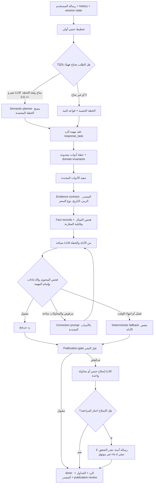

# الوضع الحالي لمعمارية الشات بوت

**هذه الوثيقة هي مرجع التسليم الحالي لأي إيجنت لاحق.**
آخر تحديث: 2026-10-07 — يشمل `c4a1be5` وإصلاحات مراجعة 7 أكتوبر المرفقة.

الملف يصف التنفيذ الفعلي في `web/src/lib/ai/`. الملفات المؤرخة مثل
`chatbot-decision-architecture-2026-10-05.md` تشرح الحوادث والقرارات التاريخية؛
لا تستخدمها لتخمين سلوك أحدث من هذه الوثيقة.

## الرسم الفعلي



## ترتيب المسؤوليات في الكود

| المرحلة | التنفيذ الحالي | المرجع |
|---|---|---|
| استقبال السياق | `runPipelineCore` يستقبل الرسالة، الصور، history، الذاكرة، والجلسة | `web/src/lib/ai/pipeline.ts` |
| التخطيط الأولي | `buildDeterministicPlannerResult` وقواعد `enforceIntentFromMessage` | `web/src/lib/ai/pipeline.ts` |
| التخطيط الدلالي | `runPlanner` يعمل فقط عندما تسمح حدود الصور/المعاملات والمفاتيح؛ الخطة الدلالية ذات الثقة الكافية تصبح authoritative | `web/src/lib/ai/pipeline.ts` قرب Stage 3 |
| عقد الرد | `completeDecisionTools` يملأ `response_task` بالمرشحين والمعيار والزمن ونوع الإجابة | `web/src/lib/ai/response-task.ts` |
| خطة الأدوات | `plannedTools` ثم `sanitizePlannerTools` و`completeToolsByFacets` | `web/src/lib/ai/pipeline.ts` |
| الأدلة | `attachEvidenceContract` ثم `buildFactRecords`؛ كل حقيقة تحمل `source/tool/as_of/fetched_at` | `web/src/lib/ai/facts.ts` و`pipeline.ts` |
| صياغة النموذج | `generateV2Stream` يستقبل الخطة، الأدلة، الذاكرة، و`correctionPrompt` | `web/src/lib/ai/final-v2.ts` |
| المراجعة الداخلية | `validateResponse` + `runAnswerGate` + `checkResponseTask` و`checkDecisionGrounding` | `web/src/lib/ai/pipeline.ts` و`answer-gate.ts` |
| الإصلاح | أسباب الرفض تدخل في `buildGateCorrectionBlock` ثم يعاد طلب الصياغة بعدد محاولات محدود | `web/src/lib/ai/pipeline.ts` |
| الاحتياطي | `buildDeterministicResponse`، ثم `buildSafeFallbackResponse` أو `safeEvidenceResponse` | `final-v2.ts` و`pipeline.ts` |
| مراجعة النشر | `runPipelineStream` يعيد فحص الرد قبل `done` ويسجل `publication_review` و`response_origin` | `web/src/lib/ai/pipeline.ts` |

## قواعد النية المهمة حاليًا

### العبارات العامة عن «الأقوى»

- `أقوى الأسهم النهارده` أو `أقوى الأسهم لاخر يوم` لا تُعامل تلقائيًا كتوصية شراء.
- يظل المجال مفتوحًا للمخطط الدلالي ليحدد: ارتفاع سعري، سيولة، زخم، أو توصيات المنصة.
- إذا كانت العبارة `أقوى الأسهم` بلا معيار أو فترة، يطلب النظام توضيحًا بدل اختراع ترتيب.
- `getMarketRankingMode` يدعم مسار أعلى الارتفاعات، ويميز طلب السيولة غير المدعوم عن التجميع.

### طلب التوصية الصريح

- `هات توصيات المنصة المفتوحة`، `رشحلي سهم للشراء`، و`ادخل في مين` تظل مسارات توصيات صريحة.
- `isExplicitRecommendationRequest` هو بوابة الاحتفاظ بأدوات `get_recommendations/get_signals`.
- لا تستخدم `isBestBuyStockQuestion` وحدها للحكم على أن الرد توصية؛ فهي كاشف واسع للعبارات الاستفهامية والسوبرلاتيف.

### عقد الرد والمراجعة

- المقارنة بين سهمين تحتاج نتيجة أو قيدًا محددًا، وليس مجرد جدول أرقام.
- لا يجوز تحويل نسبة الحجم إلى سيولة مطلقة، أو مؤشر واحد إلى أمان عام، أو إغلاق سابق إلى ضمان مستقبلي.
- اختلاف التاريخ أو نوع السعر أو غياب الدليل يمنع الترجيح الكمي الصامت.
- الرد الحتمي لا يعاد إخضاعه لمراجعة LLM عندما يكون مبنيًا مباشرة من الأدلة؛ لكن `publication gate` يظل نقطة النشر النهائية.

## سلوك الفشل والمهلة

1. عند فشل تحقق الصياغة، توجد محاولتان أو ثلاث حسب الوقت المتبقي.
2. عند عدم وجود وقت كافٍ أو فشل المزود، يستخدم النظام renderer حتميًا من نتائج الأدوات.
3. الـ fallback يمر عبر `publication gate` مرة أخرى.
4. إذا فشل الإصلاح النهائي، ينشر النظام رسالة آمنة تفيد تعذر التحقق بدل اختراع إجابة.
5. هذه ليست حلقة إصلاح غير محدودة؛ لا تضف retry جديدًا بلا ميزانية زمنية واختبار رجوع.

## حواجز هوية السهم وعمليات المحفظة — مراجعة 7 أكتوبر

- `correctStockSymbol` يطبّع الرمز ويطبق aliases الموثقة فقط؛ لا يبدله بأقرب رمز في المسافة الإملائية. الرمز غير المغطى، حتى مع سعر يدوي أو حروف مختلطة، يظل غير مغطى ولا يطلق أدوات لسهم آخر.
- الاسم غير المحلول يحتاج تعريف الشركة بالرمز/الاسم الكامل، وليس سؤالاً عن معيار ترتيب السوق. مسح السوق العام يظل مساراً مستقلاً.
- ذكر كمية ومتوسط شراء يزوّد التحليل بسياق من المستخدم، ولا يثبت الحفظ. `answer-gate` يمنع تأكيد الحفظ دون `manage_portfolio` ناجحة تحمل `operation` و`persisted=true` للرموز نفسها؛ القراءة لا تكفي. استيراد الصورة الناجح يرسل دليل العملية لبوابة النشر أيضاً.
- سعر الشراء الذي صرّح به المستخدم يُقبل كـ `entry_price` للسهم الواحد فقط، ولا يصبح إغلاقاً موثقاً أو دليلاً على ملكية محفوظة. الكمية الصريحة تُقرأ قبل تخمين ترتيب الأرقام، بما في ذلك السعر قبل العدد والأرقام العربية.
- شرح عمق السعر لا يرث رمز المحادثة السابق. تحليل دفتر أوامر لسهم يحتاج صورة واضحة ومؤرخة، إذ لا توجد أداة تغذية مباشرة لدفتر الأوامر؛ لا يُستبدل بتحليل إغلاق.
- ذكر RSI/المؤشرات الفنية للسهم لا يعني أن الرد يعرض مؤشرات السوق. إفصاح الإغلاق اليومي يظل مطلوباً عند عرض بيانات مؤشرات السوق الفعلية.

التفاصيل وحدود العينة والتحقق في `docs/chatbot-review-2026-10-07.md`.

## ما يجب أن يعرفه الإيجنت التالي

- ابدأ من هذه الوثيقة ثم راجع `pipeline.ts`, `response-task.ts`, `answer-gate.ts`, `facts.ts`, و`final-v2.ts`.
- لا تعدّل قواعد عامة في `isBestBuyStockQuestion` لتصحيح حالة واحدة قبل فحص `isExplicitRecommendationRequest` و`getMarketRankingMode`.
- عند تعديل مسار AI، شغّل الاختبارات غير الحية أولًا:

  ```powershell
  cd web
  $all = Get-ChildItem -Recurse -File -Path src |
    Where-Object { $_.Name -match '\.(test|spec)\.(js|ts|tsx)$' -and
      $_.Name -notmatch '\.live\.test\.' -and $_.FullName -notmatch '\\load\\' }
  $patterns = $all.FullName | ForEach-Object {
    $_.Substring((Get-Location).Path.Length + 1).Replace('\\','/')
  }
  npx jest --runInBand --silent $patterns
  npx tsc --noEmit
  ```

- لا تشغل اختبارات `*.live.test.*` أو مزودي LLM المدفوعين كاختبار smoke عادي.
- تغييرات الواجهة فقط لا تحتاج نشر HF؛ لا تلمس pipeline اليومي أو cache العام أثناء مراجعة المعمارية.

## حالة التحقق عند كتابة الوثيقة

- الاختبارات غير الحية الأخيرة: **78 suite ناجحة، 905 اختبارات ناجحة، 12 suite متخطية**.
- `npx tsc --noEmit`: ناجح.
- `npm run build` المحلي في مراجعة 7 أكتوبر: التجميع وفحص الأنواع ناجحان؛ تجميع بيانات الصفحات متوقف بسبب غياب إعداد `SUPABASE_URL` المحلي. تحقق نشر Vercel يُراجع بعد رفع التعديل.
