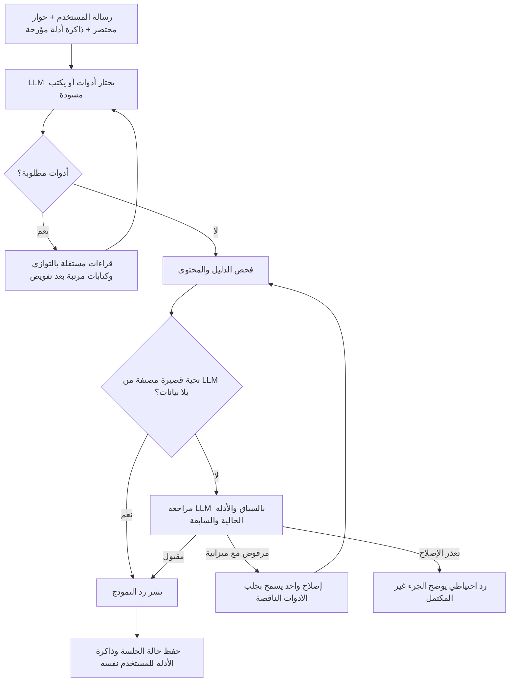

# الوضع الحالي للشات بوت — مرجع كل الإيجنتس

آخر تحديث: **9 أكتوبر 2026، بتوقيت القاهرة**. تنفيذ هذه الجولة: **Codex / Sol 6.1**.
تحديث لاحق: معالجة مراجعة جلسة الأدمن بعد إصدار `12abc88f`؛ كوميت الإصلاح `7f66a2afd66d7d487f54fc5b2aef0cad65882991`. التفاصيل في قسم إصلاح المتابعة والمراجعة أدناه. معرف `c658a148` في السجل يوثق الإصدار الأول لهذه الجولة وليس آخر إصدار.
نقطة المقارنة قبل الجولة: `498779984f691b2c876d19ef5a73aaf27eda82db`. كوميت تغيير الشات: `c658a1481b7f126c6776ad73cff487f224a64ccc`. حالة النشر وتاريخه في قسم سجل النشر أدناه.

هذه الوثيقة تصف المسار الفعلي، وحدوده واختباراته؛ نجاح اختبار لا يثبت انعدام أخطاء الإنتاج.
قبل تعديل الشات، اقرأها مع `AGENTS.md`. حدّث سجل التغييرات والقياسات والرجوع بعد كل تعديل معماري.

## مسار التنفيذ الحالي



- اختيار النية والأدوات وصياغة الإجابة بواسطة النموذج؛ لم يُضف router للنوايا يعتمد على Regex.
- قاعدة متابعة مختصرة في `AGENTIC_SYSTEM_PROMPT`: عند وضوح الرموز السابقة أو المقروءة من الصورة، يختار النموذج أداة المقارنة/التحليل/المستويات المناسبة في Round 0، دون إعادة طلب إذن الجلب. الغموض الحقيقي أو فشل الأداة يظل معلناً. لا يجلب الأدوات الثلاث آلياً لكل متابعة، ولا يحتاج الشرح العام بيانات جديدة.
- الفحوص الحتمية تخص البيانات الناتجة وصحة عمليات الحساب والكتابة. مطابقة عناوين الجداول ليست تصنيفاً لنية المستخدم.
- المسار المعتاد لتحليل بيانات: اختيار أدوات، صياغة، مراجعة (3 مكالمات). المسح ثم المستويات غالباً 4.
- التحية القصيرة التي يصنفها LLM `social`، دون أدوات/صور/أدلة سابقة/أرقام/جدول، تحتاج مكالمة واحدة بعد الفحص المحلي.
- الردود التحليلية تظل محجوزة حتى المراجعة؛ أحداث SSE للحالة تعرض التقدم. وجود SSE لا يعني بث المسودة مبكراً.
- المسار القديم داخل `pipeline.ts` ما زال احتياطاً عند غياب المفتاح أو اختبارات mock؛ كان هجيناً وفيه تخطيط لغوي أيضاً.

## الملفات والأدوات

| الملف | المسؤولية |
|---|---|
| `web/src/lib/ai/agentic-pipeline.ts` | البرومبت المختصر، مخطط الأدوات الاثنتي عشرة، واجهة الاستدعاء |
| `web/src/lib/ai/agentic-runtime.ts` | الحوار المحدود، حلقة الأدوات، مراجعة/إصلاح، المهلة، حفظ الجلسة |
| `web/src/lib/ai/agentic-publication.ts` | تأريض الأرقام بحسب السهم والحقل، ذاكرة الأدلة، الرد الاحتياطي |
| `web/src/lib/ai/agentic-tools.ts` | تنفيذ الأدوات مباشرة بقراءات Supabase محدودة |
| `web/src/lib/ai/session.ts`, `types.ts` | تحميل/دمج مخطط ذاكرة الجلسة المتوافق مع الحقول القديمة |
| `web/src/app/api/ai-chat/route.ts` | المصادقة والحصص وتسجيل المحادثة وmetadata |

| الأداة | المصدر والسلوك |
|---|---|
| `get_stock` | `stocks`, `stock_technical_indicators`, `stock_scans_summary`: اسم الشركة، إغلاق ومؤشرات مؤرخة |
| `get_stock_levels` | `stock_prices`: نطاق آخر 20 جلسة، وقف 98% من الدعم، هدف أول مقاومة، ثانٍ من نطاق 60 جلسة أو 105% المقاومة؛ حسابات وليست فيبوناتشي أو ضماناً |
| `manage_portfolio` | `positions`, `position_events`: عرض/تسجيل/تحديث/حذف/بيع، مستخدم مصادق عليه، تحقق من الصف المتغير |
| `get_market` | `market_cache` ومؤشرات الأسهم: EGX30 وقوائم الصعود/الهبوط؛ لا يدعي تغطية EGX70 أو شاشة لحظية |
| `get_recommendations` | `scan_results`: حالات وأسابيع القاهرة ورموز اختيارية؛ العائد من الخروج أو النتيجة المسجلة، والمفقود null |
| `get_technical_scan` | قالب صعود/هبوط/زخم/RSI أو عبور MACD بين جلستين؛ ليس مجرد MACD موجب |
| `get_accumulation_stocks` | أحدث `stock_scans_summary` بقيد acc_score؛ لا يثبت تدفقات نقدية مطلقة |
| `get_news` | أخبار `news` مرتبطة بـ stock_id بعد حل الرموز من stocks؛ التصفية قبل limit |
| `get_comparison` | بيانات كل رمز بما فيها MACD وإشارته وهيستوجرامه والمتوسطات |
| `list_chart_strategies` | مكتبة حتمية من عشر تحليلات مع تصنيف القابلية للاختبار وحدود التقريب؛ لا قراءة قاعدة بيانات |
| `apply_chart_strategy` | إسقاط صريح لشموع `stock_prices`، رمز/سوق وفترة محددة وحد أقصى 1000 صف؛ حساب الرسومات والإشارات بالكود |
| `compare_strategies_history` | نفس التاريخ والتكاليف لجميع الاستراتيجيات؛ مقاييس مستقلة وسجل صفقات ومنحنيات، دون اعتبار الرسومات فقط قابلة للتداول |

## ربط معمل الاستراتيجيات بالشات — 9 أكتوبر 2026

- طلب API اختياري `chart_context: { active_chart_id, charts: [{ id, symbol, timeframe }] }` بحد ثمانية شارتات وفريمات `1d/1w/1m`. تُحذف الحقول الزائدة قبل دخول سياق النموذج. اختيار الاستراتيجية والشارت يظل بواسطة الـLLM، مع تحقق حتمي من تطابق رمز الأداة بالشارت المستهدف.
- أحداث `done.chart_actions` تحمل `{ type: apply_strategy | compare_strategies, chart_id, symbol, result }` فقط بعد قبول الإجابة بالمراجعة. الرسومات والإحداثيات حتمية؛ أرقام المقارنة مرتبطة بالسهم ومعرف الاستراتيجية والمقياس. فشل الأداة أو المراجعة لا ينشر إجراء للشارت.
- الشموع تُقرأ مباشرة من Supabase وفق معمارية الأدوات الحالية. مقارنة عدة استراتيجيات تشترك في قراءة واحدة؛ استدعاءات التحليل/المقارنة المتوازية لنفس السهم والفترة تشترك في Promise داخل الطلب. لا كاش مستخدم عام ولا استدعاء HF أو تشغيل يومي أو أدوات مدفوعة للتحقق.
- تجميع الأسبوع/الشهر محلي من التاريخ اليومي. تاريخ Supabase المحدود قد يختلف عن التاريخ الكامل للشارت عبر HF؛ النتيجة تعرض حد الصفوف والفترة الفعلية وعدم التحقق من تعديلات الأحداث الرأسمالية. الرسومات الاستكشافية لا تنتج نسبة نجاح قابلة للاعتماد، وعينة أقل من عشر صفقات تُعلن غير كافية.
- تُرسل الرسومات والمنحنيات كاملة للواجهة، بينما يُختصر دليل النموذج وذاكرة الجلسة إلى أسماء الرسومات وآخر إشارة ومقاييس وقيود دون الإحداثيات وسجل الصفقات.
- اختبارات محلية: `chart-strategy-tools.test.ts` للتحقق من الإسقاط والحد والتواريخ والإعدادات وتقاسم القراءة والتأريض، و`agentic-architecture.test.ts` لضمان تطابق الهدف وإصدار الإجراء بعد المراجعة. الرجوع: إزالة الأدوات الثلاث الجديدة وحقول `chart_context/chart_actions`؛ لا تغييرات مخطط قاعدة بيانات.

## أسباب أخطاء الجولة والفرق قبل/بعد

| السبب المثبت قبل الجولة | الإصلاح الحالي | اختبار الرجوع |
|---|---|---|
| `passed=true` مع تفسير إيجابي في reasons يتحول لرفض | عقد `issues` للأخطاء و`notes` للملاحظات؛ توافق reasons القديمة عند القبول | قبول الملاحظات الإيجابية، ورفض الأخطاء الحتمية حتى مع موافقة LLM |
| متابعة بلا أداة تعتبر بيانات الدور السابق مختلقة | حفظ قراءات مؤرخة محدودة في summary_state.last_tool_evidence وعرضها للكاتب والمراجع | متابعة قصيرة بأدلة سابقة، وحفظ مع قيد user_id |
| متابعة واضحة تنتهي باعتذار وطلب إذن الجلب مرة أخرى | توجيه Round 0 للأداة المناسبة في البرومبت؛ الإصلاح يستطيع جلب النقص | اختبارات السياق والإصلاح والتجربة المحدودة لـ MACD؛ توجيه البرومبت لا يضمن عدم تكرار خطأ LLM مطلقاً |
| مقارنة استراتيجية لسهم جديد ورثت أرقام/أسهم جلسة سابقة | عزل `verificationEvidence` وfallback على رموز أدلة الجولة الحالية، مع إبقاء الذاكرة للمتابعة المرتبطة فقط | حادثة SWDY التي أظهرت AFMC/ATQA/ABUK؛ 95 اختباراً مباشراً لمسار الشات وأدوات الشارت |
| الإصلاح يعيد الكلام دون جلب النقص | نفس حلقة الأدوات تسمح بدفعة أدوات في محاولة الإصلاح، داخل الميزانية | طلب عتاقة بعد رد ناقص يجلب أداة فعلية |
| تكرار تقارير طويلة وبرومبت توجيه متضخم | برومبت تحليل مختصر وحوار آخر 8 رسائل بحد إجمالي 5000 حرف | حفظ اختيار «الأول» مع تقارير طويلة |
| تسرب قيمة سهم لعمود سهم آخر | الفحص يربط الخلية برمز عمودها وحقلها | تبادل سعر COMI/EAST أو وضع السعر في RSI مرفوض |
| 14/20/50/100/200 والأرقام الصغيرة تمر دون دليل | إزالة الاستثناء العام؛ فترة المؤشر تُحذف من اسم المؤشر فقط، وعمود الترتيب وحده مستثنى | رفض إغلاق مخترع بهذه القيم، وقبول ترتيب حقيقي |
| استنتاج فوق/تحت المتوسط رغم تناقض الأرقام | فحص علاقة الإغلاق بـ EMA50/200 مع استثناء السيناريو الشرطي | COMI 124.65 تحت EMA200 126.93 |
| فقد اسم القسم بسبب سطر فارغ | استمرار ملكية قسم السهم حتى ظهور قسم/رمز جديد | جدول رأسي بعد عنوان وسطر فارغ |
| ترتيب MACD بمعيار KING/السعر عند تساوي MACD | الكاتب والمراجع يحافظان على المعيار؛ يطلبان تفاصيل المقارنة عند نقصها، ويعلنان التعادل | السيناريو الحي المحدود لمتابعة MACD |
| JSON mode مع الأدوات أعاد فراغات ورابطاً، والمراجع راجع السياق السابق | صياغة عربية طبيعية دون فرض JSON عليها، مراجعة المسودة الحالية، وفحص وجود محتوى بعد استبعاد الرابط والخاتمة | رد رابط فقط لا ينشر كإجابة ناجحة |

## إصلاح المتابعة والمراجعة بعد جلسة الأدمن — 9 أكتوبر 2026

- baseline: `12abc88f8f933862dadd21f89f37b110600921c5`، جاهز في الإنتاج الساعة 19:55:48 القاهرة. عينة الأدمن التالية: 15 سؤالاً و15 رداً، 4 fallback، متوسط 9.842 ثانية و15311 توكن؛ توجد أخطاء رغم `final_passed=true` لبعض الردود.
- `finish_reason=length` في الكاتب يتحول إلى مسودة ناقصة تتطلب محاولة إكمال واحدة، ولا يُنشر الجزء المقطوع. فشل/قطع JSON المراجع الأول يدخل مسار إصلاح محدود ثم مراجعة أخيرة بدلاً من إيقاف الطلب فوراً. الرد المقطوع في المحاولة الأخيرة يظل مرفوضاً. حد المراجع ارتفع من 400 إلى 800 توكن؛ سقف 7 مكالمات و52 ثانية وإصلاح واحد لم يتغير.
- الإصلاح يبدأ برسالة المستخدم الحالية والأدلة المختصرة وآخر رسالتين وأسباب الرفض، بدلاً من إعادة كل سجل استدعاءات الأدوات السابق. حماية كتابة المحفظة ومنع تكرارها باقية.
- الرد الاحتياطي في runtime لا يعرض جدول اقتباسات؛ يؤكد فقط كتابة محفظة نجحت فعلاً إن وُجدت. هذا يمنع عرض سهم قديم أو أداة جُلبت خطأً عند سؤال جديد أو انتهاء المهلة. الذاكرة المؤرخة تبقى متاحة للمتابعة الصحيحة، ولا تُحذف الجلسات.
- توجيه الكاتب والمراجع: سؤال المبلغ يبدأ بالمدة/احتياج السيولة/تحمل الخسارة؛ اعتراض «إيه ده» يرجع للطلب المتعثر؛ رمز جديد يحتاج التحقق من بياناته؛ الفترة الحديثة محددة ومعلنة؛ لا اختراع اسم شركة عندما الدليل يحوي الكود فقط.
- فحص محتوى الرد يمنع أسماء الأدوات والجداول الداخلية؛ هذه مطابقة لمحتوى منشور وليست router لنوايا المستخدم. أسماء المؤشرات واستراتيجيات مثل MACD/SMC تبقى مسموحة. يشرح الكاتب الخدمات باسم وظيفتها للمستخدم.
- أداة `compare_strategies_history` تقبل استراتيجية واحدة، فلا تفرض استراتيجية ثانية غير مطلوبة عند السؤال عن نجاح MACD وحده. دلالتها الجديدة اختبار واحدة أو مقارنة عدة استراتيجيات؛ لا أداة جديدة.
- فحص مقاييس الاستراتيجية لا يقارن نسبة مئوية بعدد الصفقات أو بمعامل الربح. فحوص أرقام جدول الاستراتيجية باقية.
- التحقق غير الحي: **106 مجموعات، 1193 اختباراً ناجحاً، 22 متخطية**. الاختبارات المباشرة للمسار والأدوات: **101/101**. TypeScript ناجح. سجل النشر النهائي يسجل حالة البناء/الإنتاج بعد رفع هذا الإصلاح.
- تجربة النموذج الحية محدودة وتستخدم شموعاً اصطناعية وعميل بيانات يمنع الكتابة، وليست تحققاً من أرباح أسهم الإنتاج. COMI اختار المقارنة؛ سؤال المبلغ بعد الإصلاح 4.444 ثانية، صفر أدوات، طلب المدة والمخاطر؛ ELEC تحقّق من تاريخه 5.836 ثانية؛ آخر 60 شمعة استخدم `bar_limit=60` في 5.977 ثانية. اعتراض المستخدم عاد إلى سؤال المبلغ في 4.517 ثانية، وسؤال الخدمات عرض أسماء طبيعية في 4.705 ثانية.
- التجربة الأولى لسؤال المبلغ فشلت وربطته بسهم سابق؛ دفعت إلى تعديل سياق الإصلاح والتوجيه. اختبار الاعتراض والخدمات احتوى شرطاً أوسع من الهدف يمنع مجرد ذكر الرمز السابق، فرفض إجابات صحيحة لا تعرض أسعاره. عُدل الشرط للتحقق من إنجاز الطلب وغياب جداول/أدوات غير لازمة؛ أعيد فحص جواب الخدمات المحفوظ دون مكالمة مدفوعة جديدة. لا يُدّعى أن كل محاولات التجربة نجحت.
- اختبار opt-in: `admin-followup-repair.live.test.ts` عبر `RUN_ADMIN_FOLLOWUP_REPLAY=1`، مكالمات محدودة؛ `REPLAY_START_CASE` لاستكمال الحالات دون تكرار ما تحقق. ملفات scratch تشخيصات محلية، والاختبارات الملتزمة هنا قابلة للتكرار.
- إعادة السؤال الأصلي لـ SWDY بعد الإصلاح: **5.986 ثانية، 12283 توكن، 3 مكالمات نموذج وأداة واحدة**؛ استخدم `price_action/smc/trend_macd` فقط، دون ABUK من الذاكرة. النموذج والمراجع قبلا الرد. الأرقام نفسها من fixture اصطناعي ولا تصف عائد SWDY الفعلي. البناء النهائي بعد آخر تعديل runtime ناجح (64 صفحة)، مع تنبيهات الكاش/بيانات السوق المحلية المعتادة؛ لا يثبت صحة بيانات الإنتاج.
- متابعة COMI/TMGH: رد الأدمن `9796c2ad-e7b1-453a-bfc6-a2f9d59cc701` في 9 أكتوبر 21:59:10 القاهرة خرج بعنوان «تصحيح الجدول» وشرح التعديلات الداخلية، 18.042 ثانية و6 مكالمات. سجل `repaired=true` مؤكد، لكن أسباب الرفض الأول لم تُحفظ في metadata النهائية؛ لا نفترض منها أن الفحص الحتمي رفض التقريب. الفحص الحتمي يقبل تقريباً صحيحاً بالفعل.
- إصلاح هذه المتابعة يطلب من الكاتب والمراجع جواباً نهائياً كاملاً، ويمنع سرد سجل الإصلاح، ويسمح بالتقريب الصحيح للعرض مع حفظ الإشارة والمعنى. الأسعار والمتوسطات بخانتين عادةً وMACD بثلاث عند الحاجة. اختبار COMI/TMGH يثبت قبول التقريب ورفض تبادل القيم بين السهمين؛ **102 اختبار مباشر ناجح** بعد هذه الإضافة.
- تجربة `comparison-repair-tone.live.test.ts` اختبرت الكاتب فعلياً مع بيانات COMI/TMGH المطابقة للأرقام المنشورة، ورفض أول اصطناعي لتفعيل مسار الإصلاح. خرجت مقارنة طبيعية مكتملة بتقريب مقروء دون «ما تم إصلاحه»: 9.498 ثانية، 5 خطوات نموذج (إحداها رفض محاكى)، 16649 توكن مسجلة. ليست مقارنة سرعة مضبوطة مع الإنتاج، ولا اختباراً لكل سياقات الحساب. هذه الجولة تعديل توجيه فقط؛ أعيدت الاختبارات المباشرة وفحص diff، ولم يُكرر البناء المحلي الكامل.
- متابعة الاستنتاجات بعد ذلك: النص وصف COMI بأنه أقرب إلى EMA200 رغم أن المسافة النسبية نحو 1.8% مقابل نحو 0.5% لـTMGH. أضيف فحص حتمي لترتيب القرب/البعد النسبي = abs(close-EMA)/EMA داخل مقارنة مؤرخة متجانسة، يستعمل أحدث سجل لنفس مجموعة الأسهم. لا يحكم على مقارنة تاريخين مختلفين أو مقارنة متوسطين داخل سهم واحد. فحوص `get_comparison` لا تختار نية المستخدم.
- الكاتب والمراجع يميزان موقع السعر الحالي عن ميل المتوسط، وعلاقة MACD بخط الإشارة عن تغير الزخم عبر الزمن. هيستوجرام موجب وحده لا يثبت «يتراجع تدريجياً»، وسالب وحده لا يثبت «يتباطأ». وr_vol أقل من 1 لا يصبح أعلى من متوسط النشاط لمجرد أنه أكبر من سهم آخر. طلب اختبار استراتيجية تختارها أنت يظل واحدة.
- 103 اختبارات مباشرة ناجحة، وTypeScript ناجح. إعادة تجربة المقارنة مع إصلاح أول محاكى خرجت بـTMGH الأقرب، دون ادعاء ميل المتوسط أو تغير زمني من اللقطة: 9.359 ثانية/17798 توكن. تجربة المتابعة «اختبره في استراتيجية من عندك» على AFMC اختارت `price_action` وحدها: 5.804 ثانية/12076 توكن؛ الشموع اصطناعية وعائدها لا يصف AFMC الفعلي. النتائج تقيس هذه العينات فقط ولا تعني انعدام الأخطاء.
- البناء النهائي لهذا الفحص الحتمي نجح (64 صفحة)، مع تنبيهات البيانات المحلية المعتادة. baseline قبله: Git `54455e84972234d200e633899266e40ac477dcff` (توثيق) وكود `257e4214`؛ كوميت التغيير `03bc24ba334b2b17436c5ef82197c14019fd2abb` بعنوان `fix(chat): verify relative distance and snapshot conclusions`، بتاريخ 9 أكتوبر 2026، 22:33:26 القاهرة. الرجوع يعكس هذا الكوميت بعد مراجعة التغييرات التالية، دون استعادة كل المسار أو حذف الجلسات.
- نشر `03bc24ba` مؤكد بحالة Vercel **success** المرتبطة بالكوميت في GitHub، بتاريخ **9 أكتوبر 2026، 22:36:31 القاهرة** (19:36:31 UTC)، معرف النشر `dpl_4gbUpTBy75ddMUZgqyrsv4UksTwy`. وقت تحديث حالة النشر ليس قراءة `readyAt`. هذا التأكيد مضاف بكوميت توثيق تالٍ دون تغيير كود الشات.

## أسئلة تفاعلية لاختبار الاستراتيجيات بعد تحليل السهم

- `strategy-followups.ts` يصنع ثلاثة اقتراحات عرض من أدلة تحليل/مستويات السهم في الرد الحالي المقبول، عند وجود رمز واحد واضح وإغلاق صالح. لا يصنف نية المستخدم، ولا يعتمد على Regex لرسالة المستخدم أو رموز جلسة قديمة، ولا يضيف طلب نموذج أو استعلام سوق.
- الأسئلة تتضمن الرمز صراحة: اختبار الاتجاه وMACD مع نسبة النجاح والعائد التراكمي؛ مقارنة الاستراتيجيات القابلة للاختبار؛ اختبار الاتجاه وMACD على آخر 60 جلسة. واجهة `FormattedChatMessage` القائمة تعرضها كأزرار وتُرسل نص السؤال الكامل عبر `sendMessage` داخل المحادثة.
- مسارا JSON وSSE في `ai-chat/route.ts` يرجعان نفس الاقتراحات ويخزنانها في `metadata.suggested_buttons` للرد. GET يعيدها باسم `suggestedButtons` للرسائل المملوكة للمستخدم، دون كشف باقي metadata. لا migration ولا تعديل RLS؛ في سجل قديم بلا metadata يبقى التوافق السابق.
- لا اختيار اعتباطي لأحد سهمين في مقارنة، ولا اقتراح اختبار مبني على أداة فشلت أو رد رفضته المراجعة. ظهور الزر لا يشغل باكتيست؛ الضغط عليه رسالة جديدة ضمن المصادقة والحصص القائمة.
- اختبار سهم مذكور مختلف عن الشارت المفتوح يمكن أن يقرأ تاريخه عبر `compare_strategies_history` بلا `chart_id`، فلا يربط النتائج بشارت سهم آخر. حماية تطابق الرمز عند طلب شارت محدد صراحة باقية، وواجهة الشارت ترفض نتيجة لرمز مخالف.
- اختبارات مباشرة: اقتراحات نفس السهم/تغيير السهم/البيانات المفقودة/تعدد الرموز، الضغط على الزر، إعادة فتح الجلسة وحصر القراءة بمالكها، ومسار AFMC مع شارت COMI المفتوح. 94 اختباراً في أربع مجموعات + اختباران لاسترجاع السجل نجحت؛ TypeScript ناجح. الاختبارات تستخدم بيانات معزولة دون مكالمات نموذج مدفوعة.
- البناء النهائي ناجح (64 صفحة)، مع تنبيهات بيانات السوق المحلية المعتادة. baseline: `6b7a39be` (توثيق) وكود الشات `03bc24ba`. عنوان كوميت الميزة `feat(chat): add stock-specific strategy follow-up buttons`. الرجوع يعكس هذا الكوميت بعد مراجعة أي تغييرات لاحقة؛ metadata الاختيارية لا تحتاج تنظيفاً أو migration عكسية.

## قيود الذاكرة والموارد

- `last_tool_evidence` قراءات فقط، بحد 6 سجلات و8000 حرف JSON وعمر 24 ساعة. لا تعني أن سعر أمس سعر الآن.
- لا تُحفظ كتابة محفظة كإثبات لعملية جديدة، ولا تدخل محافظ مستخدم في كاش عام. الخادم يحمل summary_state من جلسة المستخدم المصادق عليه.
- الحفظ يستخدم حقل JSON الموجود؛ لا migration جديدة ولا تعديل RLS ولا إعدادات سجل/كاش.
- الميزانية باقية: 3 دفعات أدوات، 12 استدعاء أداة، إصلاح واحد، 7 مكالمات نموذج، و52 ثانية إجمالية. قراءة الصور لها مزودها القائم؛ usage المذكورة لا تشمل مزود الرؤية.
- الإصلاح الذي يحتاج أداة إضافية قد يبقى أبطأ من الإجابة الصحيحة الأولى. لا تضف مراجعات أو retries غير محدودة.
- النتائج الحالية للمحفظة تتحقق من الأرقام والرمز والكمية، والبيع لا يحدّث النقد (`cash_updated=false`). المركز والحدث ليسا معاملة ذرية واحدة؛ منع التكرار داخل الطلب لا يغني عن حماية الإنشاء المتزامن بين الطلبات.

## التحقق وقياس السرعة

الاختبارات المباشرة: `web/src/lib/ai/__tests__/agentic-architecture.test.ts`، تشمل الأدوات التسعة ببيانات سليمة وأخطاء وقراءات محدودة، المحفظة، السياق، الأرقام، المراجعة والمهلة.

```powershell
cd web
npm run test:offline -- --runInBand --silent
npx tsc --noEmit --incremental false
npm run build
```

الاختبار المدفوع opt-in: `agentic-architecture.live.test.ts`، بيانات معزولة بلا كتابة في Supabase. لا تشغل suite الحسابات الحقيقية أو تنظيف مراكزها كـ smoke.
تقارير المقارنة: `scratch/agentic-sol61-smoke-2026-10-08.json` (قبل)، و`scratch/agentic-compact-smoke-2026-10-09.json` (بعد).
القياسات عينات وليست SLA أو نسبة دقة. لا تقارن اختبار fixture واحد بمتوسط إنتاج لمستخدمين مختلفين كأنه تجربة مضبوطة.

نتائج 9 أكتوبر:
- 78 اختباراً مباشراً للمسار الحالي، بما فيها الأدوات التسعة والرجوع للحالات المكتشفة.
- المجموعة غير الحية كاملة: **98 مجموعة ناجحة، 1110 اختبارات ناجحة، 22 متخطية**. استُبعد `.next` من فهرسة Jest بسبب توليد ملف مؤقت أثناء العمل؛ لم تُحذف ملفات البناء.
- آخر `tsc --noEmit --incremental false`: ناجح. البناء الإنتاجي المحلي نجح (62 صفحة). ظهرت تنبيهات Runtime Cache وعدم توفر بعض بيانات السوق أثناء التوليد المحلي؛ ذلك ليس اختباراً لبيانات الإنتاج أو نشر Vercel.
- تجربة مسح ثم مستويات على بيانات معزولة: 8.101 ثانية / 10602 توكن / 4 مكالمات، مقابل العينة المحفوظة 8.485 ثانية / 15758 توكن. ليست SLA.
- متابعة MACD: 8.324 ثانية / 18139 توكن / 5 مكالمات؛ أصلحت المراجعة تبديل معيار الترتيب وجلبت المقارنة. هذه حالة ما زالت تحتاج إصلاحاً وتكلف أكثر من الإجابة الصحيحة الأولى.
- اختبار AFMC/عتاقة في آخر إعداد: 6.854 ثانية / 10079 توكن، انتهى LLM مع قبول المراجعة وتمييز AFMC وATQA. التجارب السابقة الفاشلة كشفت إخراج فراغات مع رابط، وعدم التمييز بين الطلب الحالي والحوار السابق؛ منع المحتوى الفارغ وإزالة JSON mode للصياغة التحليلية أصلحا مسار الإخراج.
- التحقق من دليل الأسهم أظهر أن name_ar لـ AFMC وATQA فارغ. جُرّب بحث أسماء عربي ثم أُزيل قبل الاعتماد لأنه لا يعمل مع المصدر الفعلي؛ لم تُضف أسماء أو aliases لقاعدة البيانات. بقي حل أسماء المستخدم بواسطة LLM، دون استبدال رموز كودي.
- حادثة جلسة الأدمن في 9 أكتوبر: طلب مقارنة `SWDY` بين `price_action` و`trend_macd` و`smc` استدعى أداة المقارنة، لكن المراجع وfallback قرآ أدلة AFMC القديمة من الجلسة نفسها؛ ظهر رد بأسهم ATQA/ABUK/AFMC ثم رُفض بـ`strategy_metric_mismatch`. الإصلاح يعزل أدلة الجولة الحالية عند وجود رموزها، ولا يعرض fallback اقتباسات من جلسة أخرى.
- **مقارنة اختبارات الأدمن المنشورة:** التفاصيل في [chatbot-admin-comparison-2026-10-09.md](chatbot-admin-comparison-2026-10-09.md). الكوميت المنشور له عرض وجداول جيدة، مع عيوب متابعة/استنتاج محددة. مقارنة بنفس سؤال COMI/EAST ونفس بيانات المصدر: 7.936 ثانية / 7407 توكن محلياً مقابل 10.219 ثانية / 19569 توكن في الإنتاج؛ تاريخ الحوار مختلف فلا نَعِد بنسبة تحسن عامة.
- أُعيدت الاختبارات المباشرة بعد إضافة قاعدة المتابعة في Round 0: 78/78 ناجحة. القياسات الحية أعلاه تخص إعداد البرومبت قبل هذه الإضافة الأخيرة؛ لم تُعَد المكالمات المدفوعة لإثبات توجيه لغوي لا يقدم ضماناً مطلقاً.
- لا تعديل لمكونات الجداول أو Python/HF أو RLS. حالة الرفع والنشر موثقة منفصلة أدناه.

## سجل النشر

### إصدار صياغة المقارنة النهائية بعد الإصلاح

- كود الإصلاح: `257e42145dea812dd540fb300dd3f4eaddd2382b`، بتاريخ 9 أكتوبر 2026، 22:03:45 القاهرة. والده `ddbf5622893aa5c944c0694917e465280bc3295b` توثيق فقط؛ كود الشات السابق `7f66a2afd66d7d487f54fc5b2aef0cad65882991`.
- رفع `origin/main` مؤكد؛ معرف نشر الإنتاج `dpl_Dz3tvkKvEsYeo4nRJaFSe5gDJKuL`. حالة الكوميت المرتبطة من Vercel في GitHub **success** بتاريخ **9 أكتوبر 2026، 22:05:50 القاهرة** (19:05:50 UTC)، ورابط الحالة يحمل معرف النشر نفسه. هذه ساعة تحديث حالة النشر، وليست قراءة `readyAt`.
- تأكيد النشر النهائي استُخدم فيه GitHub Commit Status بعدما اختفى Vercel CLI من بيئة التنفيذ، ورفض موصل Vercel القراءة المباشرة بـ403. لم يُعَد النشر ولم تُغير صلاحيات الحساب. سجل حالة الإنتاج قبل ذلك ربط النشر بالفرع والهدف والكوميت الصحيحين.
- 102 اختبار مباشر ناجح وتجربة إكمال المقارنة مع الكاتب الفعلي؛ الرفض الأول في التجربة مصطنع لاختبار مسار الإصلاح. تغيير توجيه الصياغة والمراجع، دون تعديل حسابات السوق أو تسامح فحص الأرقام.

### إصدار إصلاح جلسة الأدمن

- كود الإصلاح: `7f66a2afd66d7d487f54fc5b2aef0cad65882991`، السابق مباشرة `12abc88f8f933862dadd21f89f37b110600921c5`.
- رفع GitHub `origin/main` مؤكد في 9 أكتوبر 2026؛ كوميت الكود بتاريخ 21:49:24 القاهرة. هدف Git/Vercel `stokscan-ai-web` و`egxbots.com`.
- معرف النشر `dpl_VB8t9vbQzFZSV6MJM8xHTynNa5Tv`، **READY** فعلياً في **9 أكتوبر 2026، 21:51:39 القاهرة (+03:00)**، الموافق 18:51:39 UTC. تم التحقق من `targets.production` ومعرف Git الكامل وتعيين `egxbots.com`. هذا وقت نشر كود الإصلاح؛ أي نشر تلقائي لكوميت التوثيق التالي يخدم نفس كود الشات.
- الاختبارات النهائية: 1193 اختباراً غير حي ناجحاً و22 متخطياً؛ البناء ناجح وTypeScript ناجح. حالات النموذج محدودة ببيانات اصطناعية، والأرقام المحسوبة فيها لا تثبت أرباح الأسهم الحقيقية.
- هذا القسم مضاف بكوميت توثيق تالٍ، دون تغيير كود الشات. الرجوع لهذه الجولة يكون بمراجعة وعكس كوميت الإصلاح المحدد، مع حفظ تغييرات أي جولة أحدث.

### الإصدار الأول قبل دمج معمل الشارت

- الكوميت السابق المنشور: `498779984f691b2c876d19ef5a73aaf27eda82db`، إصلاح عرض الجداول؛ تحقق عبر Vercel من تطابقه مع إنتاج `stokscan-ai-web` قبل الرفع.
- هدف النشر: مشروع `stokscan-ai-web`، مجلد `web`، فرع GitHub `main`، الإنتاج `egxbots.com`.
- كوميت تغيير الشات: `c658a1481b7f126c6776ad73cff487f224a64ccc` — `fix(chat): preserve follow-up evidence and enforce contextual review`، بتاريخ **9 أكتوبر 2026، 01:11:11 القاهرة (+03:00)**. والده مباشرة هو الكوميت السابق أعلاه.
- رفع `origin/main` مؤكد. نشر Git للإنتاج **READY** بمعرف `dpl_51UZiAXwvqtuX2WBKYj1zMPQhcDu`؛ تحقق من تطابق `githubCommitSha` مع كوميت تغيير الشات ومن تعيين alias `egxbots.com` للإنتاج.
- وقت إنشاء النشر: **9 أكتوبر 2026، 01:11:28 القاهرة**. وقت جاهزيته الفعلي من `targets.production.readyAt`: **9 أكتوبر 2026، 01:13:20 القاهرة (+03:00)**، الموافق **8 أكتوبر، 22:13:20 UTC**. ليس هذا وقت كتابة التوثيق أو بداية البناء.
- الموقع: [egxbots.com](https://egxbots.com). النسخة الثابتة: [Deployment c658a148](https://stokscan-ai-q2qwf4u26-mr-coders-projects-2e3a65c8.vercel.app).
- تأكيد المعرف والحالة والعناوين تم بقراءات Vercel CLI محدودة، دون قراءة runtime logs أو تشغيل daily jobs. لا HF/Python في هذه الجولة.
- فحص HTTP HEAD للموقع بعد النشر: **200**، بتاريخ **9 أكتوبر 2026، 01:14:26 القاهرة**. هذا يؤكد وصول الواجهة؛ اختبارات الشات المعزولة أعلاه مستقلة عنه، ولم تُعَد اختبارات مدفوعة على حساب الإنتاج بعد الرفع.
- هذا السجل مضاف بكوميت توثيق مستقل بعد التحقق. كوميت التوثيق لا يغيّر كود الشات؛ المرجع لإصلاح/عكس هذه الجولة هو كوميت تغيير الشات أعلاه، مع مراجعة أي تغييرات لاحقة قبل الرجوع. أي نشر Git تلقائي لاحق لكوميت التوثيق يخدم نفس كود الشات؛ وقت النشر المسجل هنا يخص أول إصدار الكود المحدد أعلاه.

## الرجوع الآمن والتسليم

- baseline قبل هذه الجولة: `49877998`؛ baseline قبل التقسيم المعياري: `64f3036f`. لا تخلطهما.
- لا تنفذ `git revert HEAD` وتفترض أنه يرجع إلى baseline؛ هو يعكس آخر commit فقط، وقد يكون تحديثاً مستقلاً للواجهة.
- إن سُجلت الجولة في commit، اعكس ذلك commit المحدد بعد مراجعة التغييرات اللاحقة. قبل commit، قارن `git diff 49877998 -- <files>` واحفظ التعديلات اللاحقة قبل استعادة أي ملف.
- ملفات هذه الجولة: agentic-pipeline/runtime/publication، session/types، اختبارات agentic-architecture، هذه الوثيقة والوثيقة المؤرخة المرتبطة بها.
- بعد رجوع runtime، حقول الذاكرة الجديدة اختيارية ويمكن للنسخة القديمة تجاهلها؛ لا تحذف جلسات المستخدمين أو بياناتهم.
- لا نشر أو commit أو نتيجة بناء ناجحة تُفترض من النص التاريخي؛ سجل معرف commit وحالة النشر والبناء عند حدوثها.

## التاريخ

تحديثات `d2083e86` و`6591c35b` و`feb58e9c` و`dcd72063` أضافت التقسيم وحلقة الأدوات والمراجعة ثم أصلحت بيانات وايكوف والتأريض والحوكمة.
تفاصيل المرحلة السابقة محفوظة في `docs/chatbot-agentic-architecture-2026-10-08.md`، وهي وصف تاريخي؛ هذه الوثيقة مرجع التنفيذ الحالي.
# تحديث نوافذ الشارت وزر تحليل AI — 2026-10-09

- يدعم تقسيم مساحة الشارت الأعداد 1–8. على سطح المكتب تُملأ صفوف الأعداد الفردية: 3 = 2+1، 5 = 3+2، 7 = 4+3، باستخدام شبكة 12 عموداً. يظل الهاتف يعرض النافذة النشطة فقط. تم تحديث تحقق الحفظ المحلي وواجهة حفظ مساحة العمل لدعم 5 و7.
- الميزة متاحة في Free وPro (ومدى الحياة): تعرض صفحة الخطط معمل الشارت والمقارنة التاريخية وتحليل AI من اختيارات الشارت. إرسال تحليل AI يُحسب ضمن حصة رسائل الخطة الحالية؛ أدوات الشارت المحلية لا تضيف رسائل شات. تحديث العرض لا يغير الأسعار أو الحصص أو صلاحيات الحسابات.
- زر تحليل الشارت يحمل بادج AI بجوار أيقونة المخ، ويظهر بعد زر الإضافات. السؤال يُبنى وقت الضغط من رمز نافذته، الفريم، عدد الشموع، الاستراتيجيات الظاهرة، والمؤشرات الظاهرة مع إعداداتها. المؤشر أو الاستراتيجية المخفيان لا يُدرجان. TradingViewChart يمرر تغير المؤشرات إلى ذاكرة النافذة دون استدعاء شبكة إضافي.
- يُنشر سياق نفس النافذة قبل حدث `open-chat-with-message`، حتى عند الضغط على نافذة غير النافذة النشطة السابقة. اختيار النية والأدوات وصياغة الرد يظلان مسؤولية مسار LLM الموجود.
- التراجع: استعادة التغييرات الخاصة بهذه الميزة في StrategyWorkspace.tsx وTradingViewChart.tsx وworkspace-state.ts وchart-workspace.ts واختبار StrategyWorkspace.test.tsx. المرجع السابق: `1743fa7c27b5f9227e940fe6f37f542bdf1edaea`.
- فحص أدوات الشريط كشف استمرار إعدادات الصفقة عند تبديل رمز النافذة؛ تم مسح `tradeSettings` مع الرسومات عند تغيير السهم. اسم ملف الصورة يتبع رمز النافذة المصوّرة، حتى إن كانت نافذة أخرى نشطة. في التقسيم المتعدد ارتفاع لوحة المؤشر السفلي 60 بدلاً من 120 بكسل لإتاحة مساحة لشموع السعر.
- تحقق محلي: 76 اختباراً في 6 مجموعات ناجحة (الشارت، المقارنة، محرك الاستراتيجيات، أدوات الشات، الحفظ، وسياق الشارت)، مع فحص TypeScript. تحقق بصري من 3 و5 و7 والموبايل. تجربتا Brave أرسلتا COMI مع MACD وEMA200 وRSI14 دون EMA50 المخفي (13.54 ثانية)، ثم AFMC مع البرايس أكشن والمؤشرات الحالية دون استراتيجية MACD المخفية (9.88 ثانية). هذان اختبارا رد حيان محدودان، وليسا ضماناً لجودة كل الردود.
- المقارنة في Brave أعادت الحساب بعد إضافة البرايس أكشن وتغيير الفترة ورأس المال، ورسمت صفقات الاستراتيجيتين. السيناريوهات وإدارة الصفقة والاختراق الكاذب رسمت نتائجها؛ القوة النسبية استخدمت 474 تاريخاً مشتركاً لـ COMI وTMGH. الأحداث أعلنت عدم توفر مصادر مؤرخة. التقييم اليدوي واستخراج اسم الصورة تم التحقق منهما باختبارات محلية. الحساب بقي Free طوال الاختبارات دون تغيير الاشتراك.
- `npm run build` نجح بعد التغييرات (64 صفحة)، بما يشمل فحص الأنواع. بقيت تحذيرات البيئة المحلية المعروفة عن الكاش وغياب بعض بيانات السوق أثناء توليد الصفحات. اختبار التنزيل الحي لم يلتقط حدث تنزيل خلال 15 ثانية، وفحص سجل تنزيلات Brave منعته سياسة المتصفح؛ لذلك لا يُسجل نجاح تصدير حي في هذه المراجعة.

## إصلاح سيناريو المحفظة والمسح بعد مراجعة الأدمن — 2026-10-10

- المرجع السابق `1791939d77f95f5732c3690b36fd56ebc9b95ab6`. التفاصيل والأدلة وحدود التحقق في [chatbot-admin-fixes-2026-10-10.md](chatbot-admin-fixes-2026-10-10.md).
- ربط نسب ومبالغ السيناريو وصفوف القطاعات والصناعات واختبارات الهبوط بأدلتها، وفصل القطاع العام عن الصناعة. الرد الاحتياطي يحتفظ بالحسابات المتحققة عند تعثر الشرح.
- المسح يحترم الحدود الصارمة والشاملة ودقة الأسعار الصغيرة. المساواة بالمقاومة ليست تحتها ولا دليلاً على اختراق مقاومة سابقة. المسح المكتمل بلا نتائج يختلف عن غياب البيانات.
- ذاكرة المسح والسيناريو ضمن الحدود الموجودة، مع إزالة الخاتمة المتكررة والأدلة التي جرى تحديث نفس طلبها من سياق الكاتب والمراجع. لم يُقَس توفير فعلي في زمن أو توكنات الإنتاج.
- التحقق المحلي: 1236 اختباراً في 110 مجموعات ناجحة و22 متخطياً، بينها 108 اختبارات مباشرة للمعمارية، وفحص TypeScript ناجح.
- `npm run build` ناجح: 64 صفحة في نسخة معزولة مطابقة للكود مع بيانات Supabase اختبار محلية فارغة. لم تُجرَ مكالمات نموذج مدفوعة أو تجربة من حساب الأدمن بعد هذا التعديل. رفع Git وحالة نشر الموقع يتحقق منهما منفصلين؛ نجاح البناء المحلي لا يثبت النشر.

## إصلاح اختبارات المتابعة الحية — 10 أكتوبر 2026

- المرجع السابق: `0fa900c8e9f33d9eec88c3a653dce1a927dc0acd`. إعادة إنتاج فعلية من ARTORO على الموقع كشفت رفض نسب المسافة عن الدعم والمقاومة، ورفض جدول خسائر محفظة افتراضية بعد تغيير التوزيع إلى 60/25/15.
- نسب المسافة تُشتق من الإغلاق والمستوى في نفس صف الدليل، وتُربط بالسهم ونوع المستوى؛ لا تسمح باستعارة نسبة سهم آخر. أساسها الإغلاق، ويظل الكاتب مسؤولاً عن توضيح أساس النسبة.
- تطبيع علامة السالب Unicode قبل مطابقة صف الهبوط يربط خسارة المحفظة والمتبقي بسيناريو المحفظة، بدلاً من آخر سهم في الجدول السابق. القيم المعدلة أو المخالفة تبقى مرفوضة.
- تعليمات المراجع تجعل طلب المتابعة الحالي مرجع الأجزاء المطلوبة؛ إضافة رمز لمقارنة الدعم لا تستدعي إلزاماً بأخبار لذلك الرمز من طلب سابق. يستمر إعلان نقص الرمز وإكمال الأسهم المعروفة.
- تحقق محلي: 140 اختباراً في 6 مجموعات ناجحة، وTypeScript no-emit ناجح. تجميع Next.js نجح، لكن اكتمال البناء المحلي تعطل أثناء جمع الصفحات بسبب غياب إعداد supabaseUrl؛ لا يُسجل بناء كامل ناجح. تحقق النشر والاختبارات الحية بعد الرفع منفصلان.
- الرجوع: إلغاء كوميت هذه الجولة المحدد، بعد مراجعة التغييرات اللاحقة. لا تغييرات لقاعدة البيانات أو صلاحياتها أو وظائف HF أو مراكز المحافظ الحقيقية.

- التحقق الحي على إصدار `84b1a0d4`: سيناريو 60/25/15 مع جدول الخسارة والمتبقي نجح في 9.06 ثانية. المقارنة في جلسة تحتوي محفظة سابقة كشفت تداخل إسناد آخر: جدول فني بعمود «المسافة النسبية للدعم» كان يفسر كجدول توزيع. قُيد إسناد صف السيناريو بجداول المبالغ/التوزيع الفعلية، مع اختبار إيجابي وسلبي يجمع الدليلين. 130 اختباراً في مجموعتي المعمارية والمحفظة نجحت بعد هذا التعديل.

- على `34232a97` نجحت مقارنة COMI/SWDY مع ZZZZ99 في نفس الجلسة (15.85 ثانية، final_passed=true). اختبار المحفظة الإضافي كشف شكلي «السيناريو» كعنوان عمود الهبوط و«الإجمالي» داخل جدول القطاع؛ دعم إسنادهما لحسابات السيناريو، مع رفض الخسارة المتغيرة. اختبارات المعمارية والمحفظة (130) وفحص الأنواع ناجحة بعد التعديل.


## إصلاح رفض نتائج اختبارات المستخدم — 10 أكتوبر 2026

- المرجع السابق: `1114d9b65f71557ee918997f052889f176e1e156`. حالات المستخدم: مدينة مصر/المسافات، مركز فوري 17 سهم × 14.80 دون حفظ، وتحليل الشرقية للدخان مع جزء مؤسسي غير متاح.
- التحقق من الجدول يربط كل خلية بالسهم والمقياس والعمود: سعر الدعم مستقل عن النسبة في عمود المسافة/الموقع بالنسبة للإغلاق. المسافات محسوبة من نفس صف المستويات وتعرضها الأداة مع المقام والإشارة؛ يقبل التقريب إلى عدد المنازل المعروض ويستمر رفض الأسعار المستعارة وقلب الإشارة.
- أداة `calculate_position` يختارها LLM لحساب مركز مؤقت بكمية ومتوسط شراء صريحين. قراءة واحدة محددة للرمز من المؤشرات اليومية (`date,close`, limit=1)، وحساب حتمي للتكلفة والقيمة والربح النقدي والنسبة. لا تقرأ أو تكتب مراكز الحساب. غياب سعر مؤرخ يبقي التكلفة فقط ولا يجعل الربح صفراً. حقائقها تدخل التحقق والرد الاحتياطي، وتطابق المدخلات الصريحة الحالية. صف «عدد الأسهم» في جدول السهم لا يتحول إلى إجمالي محفظة بسبب دليل محفظة سابقة.
- مراجعة LLM تطلب اعتراضات منظمة: `claim` مع اقتباس من المسودة، أو `omission` لجزء مطلوب غائب. اقتباس غير موجود في المسودة يعيد المراجعة مرة ضمن الميزانية القائمة، ولا يتسبب في إعادة كتابة إجابة بناء على حقل في بيانات الأداة. الأخطاء الحقيقية والرفض بلا سبب لا يحصلان على موافقة تلقائية.
- تحقق محلي: 160 اختباراً في خمس مجموعات ناجحة؛ فحص TypeScript no-emit ناجح على النسخة النهائية. اختبارات جديدة تشمل الحسابات الصحيحة/المتغيرة، الإشارة، التقريب، نقص السعر، مراكز سابقة، وتوثيق اقتباس المراجع. التحقق الحي والنشر منفصلان، ولا تثبت هذه الاختبارات صحة كل صياغة للنموذج.
- الرجوع: إلغاء كوميت الإصلاح كاملاً؛ لا ترحيل بيانات أو تغيير صلاحيات أو وظائف تحديث يومية.

- تحقق الموقع على `9ebedce4`: حساب فوري (251.60/324.02/+72.42/+28.78%) في 7.94 ثانية، والشرقية مع إعلان غياب صافي المؤسسات في 9.78 ثانية؛ كلاهما رد LLM بلا إصلاح، trace مكتمل وfinal_passed=true. اختبار مدينة مصر (8.67 ثانية) أنهى الرفض الخاطئ للأرقام، لكنه كشف وصف تحسن زمني من لقطة واحدة وقلب ترتيب بعد الدعم والمقاومة، رغم موافقة المراجع. لذلك لا يُسجل مروراً مضمونياً كاملاً.
- إضافة تحقق للعلاقات التفسيرية: ترتيب بُعد الدعم/المقاومة على الإغلاق نفسه، واشتراط مشاهدتين مؤرختين لادعاء تحسن/تراجع الزخم أو ضغط البيع، مع فحص اتجاه تغير الهيستوجرام. التفسير الحالي (MACD فوق إشارته) والعبارات المنفية والشرطية تظل مسموحة؛ مقارنة سعر الدعم والمقاومة لا تُفسر تلقائياً كمقارنة مسافات.

- بعد إضافة تحقق العلاقات: 127 اختباراً في مجموعتي المعمارية والحالات الجديدة ناجحة، وفحص TypeScript no-emit ناجح.

## مراجعة إجابات المسح والأخبار والمراكز — 10 أكتوبر 2026

- شاشة القرب من المقاومة تستخدم الآن النسبة إلى الإغلاق `(المقاومة - الإغلاق) / الإغلاق × 100`، بما يطابق مدقق النشر والشرح. حد الحجم النسبي صار حصرياً افتراضياً (`>`)، ولا يصبح شاملاً إلا إذا طُلب «على الأقل» صراحة. مدقق الرد يرفض شرحاً يذكر مقاماً مختلفاً أو يساوي النسب الناتجة عن المقامين؛ تطابق الترتيب وحده لا يعني تساوي النسب.
- صفوف `stock_news_sentiment` يومية مجمعة؛ تاريخ الصف لا يثبت تاريخ نشر كل عنوان. تُحفظ كـ`record_date` ويظل تاريخ النشر غير موثق ما لم يأتِ من حقل نشر صريح، ولا تدخل في إثبات أن الخبر أحدث ما نُشر.
- RSI لقطة مستوى فقط ولا يثبت تراجع ضغط البيع أو تحسن الزخم. المراجع يرفض هذا الاستنتاج دون قراءات مؤرخة متتابعة.
- `calculate_position` يقبل التكلفة الإجمالية المعروفة؛ إذا غابت الكمية يكتفي بها ويطلب الكمية وحدها، وإذا توفرت الكمية يستنتج متوسط الشراء من التكلفة دون حفظ المركز.
- التحقق النهائي: نجاح 1282 اختباراً في 120 مجموعة بالمسار غير المتصل، منها 136 اختباراً في مجموعات المعمارية والأخبار وحالات المستخدم، وفحص TypeScript ناجح. تشمل حالات الحدود نشاطاً يساوي 1.5 واختلاف النسب مع صحة الترتيب. هذه اختبارات محلية وليست إثباتاً لتجربة الشات المنشور. الأدلة القديمة للأخبار تُصحح عند استعادة ذاكرة المحادثة، ونتائج المسح السابقة تحتفظ بمقامها المسجل.

- البناء المحلي: التجميع وفحص الأنواع نجحا، ثم تعذر تجهيز صفحات الإنتاج بسبب غياب إعداد Supabase (`supabaseUrl is required` في `/api/admin-access-log`). لا يُعد هذا نجاح بناء كامل أو تحققاً من الموقع.

## متابعة اختبارات المستخدم الثلاثة — 10 أكتوبر 2026

- روجعت الرسائل الفعلية من الفترة 13:23–13:25 بتوقيت القاهرة. نُفذت على الإصدار `25245c66` قبل رفع إصلاحات `e3ce1279`؛ سؤالا المسح والتكلفة حُجبا بخروج آمن، فيما نُشرت مقارنة تحتوي على استنتاج زمني وخطأ في مرجع النشاط.
- تكلفة شراء معلومة تدخل المدقق كحقيقة مستخدم من نوع تكلفة، ولا تُقبل كسعر إغلاق. تمييز «بسعر» في سياق الإغلاق يمنع إلصاق سعر الإغلاق بالتكلفة الواردة قبله. لا تُستنتج كمية تاريخية بقسمة تكلفة الشراء على إغلاق اليوم.
- خلايا معادلات المسافة تُفحص حسب مقاومة وإغلاق الرمز والمقام الموضح وثابت التحويل 100 والناتج المقرب. أعمدة المقارنة على أساس الإغلاق والمقاومة تُحسب كل منها بمقامها، دون اعتبار المعامل 100 سعراً أو إجبار جميع الأرقام على حقل المقاومة.
- تغيير المقام لا يقلب ترتيب المسافة للسعر الموجب والمقاومة أعلى منه أو عنده: إذا كانت نسبة المسافة على الإغلاق x قبل ضربها في 100، فإن نسبتها على المقاومة x/(1+x)، وهي دالة متزايدة.
- قيد النشاط في المسح منفصل عن المرجع 1: النشاط 1.20 أعلى من متوسط السهم رغم كونه دون حد 1.5. المدقق يراجع الحكم الجماعي على كل سهم، ويرفض التحسن الزمني من قراءة واحدة حتى عند صياغته اسماً مثل «تحسن العلاقة بين MACD وإشارته».
- دليل الأخبار القديم يُصحح قبل التحقق الحتمي أيضاً، ولا تثبت تواريخ التجميع تاريخ نشر العنوان. تغيير شروط مسح سابق يتطلب إعادة المسح، ومع غياب طلب قيد RSI ينبغي تمرير نطاق 0–100.
- أضيفت حالات إعادة تشغيل من مسودات الاختبار الفعلية، بلا معرفات مستخدم أو جلسة أو بيانات مصادقة. نجح 1285 اختباراً في 120 مجموعة محلية وفحص TypeScript؛ لا تُعد هذه النتائج وحدها تحققاً من المحادثة المنشورة.

### تحقق البرودكشن والمتابعة

- نُشرت الحزمة الأولى كإصدار `c4942fb` وجُربت الأسئلة الثلاثة من نافذة ARTORO العادية مع DeepSeek Flash وحساب اختبار مصادق عليه. سؤال التكلفة نجح دون حفظ أو اختلاق قيمة المركز، وسؤال الأخبار فصل تاريخ التجميع عن النشر.
- مسح بلا قيد RSI أعاد ثلاثة أسهم عند مقاومتها بمسافة صفر؛ كشف الاختبار أن المدقق كان يربط عمود «المسافة (÷ الإغلاق)» بحقل السعر، ويرفض تفسير المقامين أو عبارة «الترتيب لا يتغير» بالخطأ. صححت معالجة الأعمدة والصيغ المنفصلة والنفي، مع استمرار رفض المقام الخاطئ وانقلاب الترتيب.
- المقارنة المنشورة وصفت EFID بأنه الأقرب للتشبع البيعي رغم أن JUFO أقرب عددياً إلى 30. أضيف فحص للأقرب اعتماداً على القراءات المتزامنة، ومنع أسماء حقول الأخبار الداخلية في الإجابة.
- الاختبارات المحلية الكاملة لهذه المتابعة: 1287 اختباراً وفحص TypeScript ناجحان. أضيف بعدهما اختبار مستقل لعرض معادلتي المقام في سطرين، ونجحت المجموعة المتأثرة بـ137 اختباراً. يلزم إعادة سؤالَي المسح والمقارنة بعد نشر المتابعة؛ نتائج الحزمة الأولى لا تُعد تحققاً من النسخة التالية.
