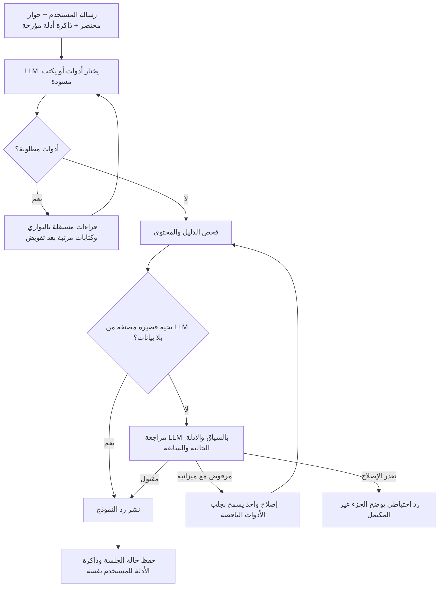

# الوضع الحالي للشات بوت — مرجع كل الإيجنتس

آخر تحديث: **9 أكتوبر 2026، بتوقيت القاهرة**. تنفيذ هذه الجولة: **Codex / Sol 6.1**.
نقطة المقارنة قبل الجولة: `498779984f691b2c876d19ef5a73aaf27eda82db`. كوميت تغيير الشات: `c658a1481b7f126c6776ad73cff487f224a64ccc`. حالة النشر وتاريخه في قسم سجل النشر أدناه.

هذه الوثيقة تصف المسار الفعلي، وحدوده واختباراته؛ نجاح اختبار لا يثبت انعدام أخطاء الإنتاج.
قبل تعديل الشات، اقرأها مع `AGENTS.md`. حدّث سجل التغييرات والقياسات والرجوع بعد كل تعديل معماري.

## مسار التنفيذ الحالي



- اختيار النية والأدوات وصياغة الإجابة بواسطة النموذج؛ لم يُضف router للنوايا يعتمد على Regex.
- قاعدة متابعة مختصرة في `AGENTIC_SYSTEM_PROMPT`: عند وضوح الرموز السابقة أو المقروءة من الصورة، يختار النموذج أداة المقارنة/التحليل/المستويات المناسبة في Round 0، دون إعادة طلب إذن الجلب. الغموض الحقيقي أو فشل الأداة يظل معلناً. لا يجلب الأدوات الثلاث آلياً لكل متابعة، ولا يحتاج الشرح العام بيانات جديدة.
- الفحوص الحتمية تخص البيانات الناتجة وصحة عمليات الحساب والكتابة. مطابقة عناوين الجداول ليست تصنيفاً لنية المستخدم.
- المسار المعتاد لتحليل بيانات: اختيار أدوات، صياغة، مراجعة (3 مكالمات). المسح ثم المستويات غالباً 4.
- التحية القصيرة التي يصنفها LLM `social`، دون أدوات/صور/أدلة سابقة/أرقام/جدول، تحتاج مكالمة واحدة بعد الفحص المحلي.
- الردود التحليلية تظل محجوزة حتى المراجعة؛ أحداث SSE للحالة تعرض التقدم. وجود SSE لا يعني بث المسودة مبكراً.
- المسار القديم داخل `pipeline.ts` ما زال احتياطاً عند غياب المفتاح أو اختبارات mock؛ كان هجيناً وفيه تخطيط لغوي أيضاً.

## الملفات والأدوات

| الملف | المسؤولية |
|---|---|
| `web/src/lib/ai/agentic-pipeline.ts` | البرومبت المختصر، مخطط الأدوات الاثنتي عشرة، واجهة الاستدعاء |
| `web/src/lib/ai/agentic-runtime.ts` | الحوار المحدود، حلقة الأدوات، مراجعة/إصلاح، المهلة، حفظ الجلسة |
| `web/src/lib/ai/agentic-publication.ts` | تأريض الأرقام بحسب السهم والحقل، ذاكرة الأدلة، الرد الاحتياطي |
| `web/src/lib/ai/agentic-tools.ts` | تنفيذ الأدوات مباشرة بقراءات Supabase محدودة |
| `web/src/lib/ai/session.ts`, `types.ts` | تحميل/دمج مخطط ذاكرة الجلسة المتوافق مع الحقول القديمة |
| `web/src/app/api/ai-chat/route.ts` | المصادقة والحصص وتسجيل المحادثة وmetadata |

| الأداة | المصدر والسلوك |
|---|---|
| `get_stock` | `stocks`, `stock_technical_indicators`, `stock_scans_summary`: اسم الشركة، إغلاق ومؤشرات مؤرخة |
| `get_stock_levels` | `stock_prices`: نطاق آخر 20 جلسة، وقف 98% من الدعم، هدف أول مقاومة، ثانٍ من نطاق 60 جلسة أو 105% المقاومة؛ حسابات وليست فيبوناتشي أو ضماناً |
| `manage_portfolio` | `positions`, `position_events`: عرض/تسجيل/تحديث/حذف/بيع، مستخدم مصادق عليه، تحقق من الصف المتغير |
| `get_market` | `market_cache` ومؤشرات الأسهم: EGX30 وقوائم الصعود/الهبوط؛ لا يدعي تغطية EGX70 أو شاشة لحظية |
| `get_recommendations` | `scan_results`: حالات وأسابيع القاهرة ورموز اختيارية؛ العائد من الخروج أو النتيجة المسجلة، والمفقود null |
| `get_technical_scan` | قالب صعود/هبوط/زخم/RSI أو عبور MACD بين جلستين؛ ليس مجرد MACD موجب |
| `get_accumulation_stocks` | أحدث `stock_scans_summary` بقيد acc_score؛ لا يثبت تدفقات نقدية مطلقة |
| `get_news` | أخبار `news` مرتبطة بـ stock_id بعد حل الرموز من stocks؛ التصفية قبل limit |
| `get_comparison` | بيانات كل رمز بما فيها MACD وإشارته وهيستوجرامه والمتوسطات |
| `list_chart_strategies` | مكتبة حتمية من عشر تحليلات مع تصنيف القابلية للاختبار وحدود التقريب؛ لا قراءة قاعدة بيانات |
| `apply_chart_strategy` | إسقاط صريح لشموع `stock_prices`، رمز/سوق وفترة محددة وحد أقصى 1000 صف؛ حساب الرسومات والإشارات بالكود |
| `compare_strategies_history` | نفس التاريخ والتكاليف لجميع الاستراتيجيات؛ مقاييس مستقلة وسجل صفقات ومنحنيات، دون اعتبار الرسومات فقط قابلة للتداول |

## ربط معمل الاستراتيجيات بالشات — 9 أكتوبر 2026

- طلب API اختياري `chart_context: { active_chart_id, charts: [{ id, symbol, timeframe }] }` بحد ثمانية شارتات وفريمات `1d/1w/1m`. تُحذف الحقول الزائدة قبل دخول سياق النموذج. اختيار الاستراتيجية والشارت يظل بواسطة الـLLM، مع تحقق حتمي من تطابق رمز الأداة بالشارت المستهدف.
- أحداث `done.chart_actions` تحمل `{ type: apply_strategy | compare_strategies, chart_id, symbol, result }` فقط بعد قبول الإجابة بالمراجعة. الرسومات والإحداثيات حتمية؛ أرقام المقارنة مرتبطة بالسهم ومعرف الاستراتيجية والمقياس. فشل الأداة أو المراجعة لا ينشر إجراء للشارت.
- الشموع تُقرأ مباشرة من Supabase وفق معمارية الأدوات الحالية. مقارنة عدة استراتيجيات تشترك في قراءة واحدة؛ استدعاءات التحليل/المقارنة المتوازية لنفس السهم والفترة تشترك في Promise داخل الطلب. لا كاش مستخدم عام ولا استدعاء HF أو تشغيل يومي أو أدوات مدفوعة للتحقق.
- تجميع الأسبوع/الشهر محلي من التاريخ اليومي. تاريخ Supabase المحدود قد يختلف عن التاريخ الكامل للشارت عبر HF؛ النتيجة تعرض حد الصفوف والفترة الفعلية وعدم التحقق من تعديلات الأحداث الرأسمالية. الرسومات الاستكشافية لا تنتج نسبة نجاح قابلة للاعتماد، وعينة أقل من عشر صفقات تُعلن غير كافية.
- تُرسل الرسومات والمنحنيات كاملة للواجهة، بينما يُختصر دليل النموذج وذاكرة الجلسة إلى أسماء الرسومات وآخر إشارة ومقاييس وقيود دون الإحداثيات وسجل الصفقات.
- اختبارات محلية: `chart-strategy-tools.test.ts` للتحقق من الإسقاط والحد والتواريخ والإعدادات وتقاسم القراءة والتأريض، و`agentic-architecture.test.ts` لضمان تطابق الهدف وإصدار الإجراء بعد المراجعة. الرجوع: إزالة الأدوات الثلاث الجديدة وحقول `chart_context/chart_actions`؛ لا تغييرات مخطط قاعدة بيانات.

## أسباب أخطاء الجولة والفرق قبل/بعد

| السبب المثبت قبل الجولة | الإصلاح الحالي | اختبار الرجوع |
|---|---|---|
| `passed=true` مع تفسير إيجابي في reasons يتحول لرفض | عقد `issues` للأخطاء و`notes` للملاحظات؛ توافق reasons القديمة عند القبول | قبول الملاحظات الإيجابية، ورفض الأخطاء الحتمية حتى مع موافقة LLM |
| متابعة بلا أداة تعتبر بيانات الدور السابق مختلقة | حفظ قراءات مؤرخة محدودة في summary_state.last_tool_evidence وعرضها للكاتب والمراجع | متابعة قصيرة بأدلة سابقة، وحفظ مع قيد user_id |
| متابعة واضحة تنتهي باعتذار وطلب إذن الجلب مرة أخرى | توجيه Round 0 للأداة المناسبة في البرومبت؛ الإصلاح يستطيع جلب النقص | اختبارات السياق والإصلاح والتجربة المحدودة لـ MACD؛ توجيه البرومبت لا يضمن عدم تكرار خطأ LLM مطلقاً |
| الإصلاح يعيد الكلام دون جلب النقص | نفس حلقة الأدوات تسمح بدفعة أدوات في محاولة الإصلاح، داخل الميزانية | طلب عتاقة بعد رد ناقص يجلب أداة فعلية |
| تكرار تقارير طويلة وبرومبت توجيه متضخم | برومبت تحليل مختصر وحوار آخر 8 رسائل بحد إجمالي 5000 حرف | حفظ اختيار «الأول» مع تقارير طويلة |
| تسرب قيمة سهم لعمود سهم آخر | الفحص يربط الخلية برمز عمودها وحقلها | تبادل سعر COMI/EAST أو وضع السعر في RSI مرفوض |
| 14/20/50/100/200 والأرقام الصغيرة تمر دون دليل | إزالة الاستثناء العام؛ فترة المؤشر تُحذف من اسم المؤشر فقط، وعمود الترتيب وحده مستثنى | رفض إغلاق مخترع بهذه القيم، وقبول ترتيب حقيقي |
| استنتاج فوق/تحت المتوسط رغم تناقض الأرقام | فحص علاقة الإغلاق بـ EMA50/200 مع استثناء السيناريو الشرطي | COMI 124.65 تحت EMA200 126.93 |
| فقد اسم القسم بسبب سطر فارغ | استمرار ملكية قسم السهم حتى ظهور قسم/رمز جديد | جدول رأسي بعد عنوان وسطر فارغ |
| ترتيب MACD بمعيار KING/السعر عند تساوي MACD | الكاتب والمراجع يحافظان على المعيار؛ يطلبان تفاصيل المقارنة عند نقصها، ويعلنان التعادل | السيناريو الحي المحدود لمتابعة MACD |
| JSON mode مع الأدوات أعاد فراغات ورابطاً، والمراجع راجع السياق السابق | صياغة عربية طبيعية دون فرض JSON عليها، مراجعة المسودة الحالية، وفحص وجود محتوى بعد استبعاد الرابط والخاتمة | رد رابط فقط لا ينشر كإجابة ناجحة |

## الذاكرة والموارد

- `last_tool_evidence` قراءات فقط، بحد 6 سجلات و8000 حرف JSON وعمر 24 ساعة. لا تعني أن سعر أمس سعر الآن.
- لا تُحفظ كتابة محفظة كإثبات لعملية جديدة، ولا تدخل محافظ مستخدم في كاش عام. الخادم يحمل summary_state من جلسة المستخدم المصادق عليه.
- الحفظ يستخدم حقل JSON الموجود؛ لا migration جديدة ولا تعديل RLS ولا إعدادات سجل/كاش.
- الميزانية باقية: 3 دفعات أدوات، 12 استدعاء أداة، إصلاح واحد، 7 مكالمات نموذج، و52 ثانية إجمالية. قراءة الصور لها مزودها القائم؛ usage المذكورة لا تشمل مزود الرؤية.
- الإصلاح الذي يحتاج أداة إضافية قد يبقى أبطأ من الإجابة الصحيحة الأولى. لا تضف مراجعات أو retries غير محدودة.
- النتائج الحالية للمحفظة تتحقق من الأرقام والرمز والكمية، والبيع لا يحدّث النقد (`cash_updated=false`). المركز والحدث ليسا معاملة ذرية واحدة؛ منع التكرار داخل الطلب لا يغني عن حماية الإنشاء المتزامن بين الطلبات.

## التحقق وقياس السرعة

الاختبارات المباشرة: `web/src/lib/ai/__tests__/agentic-architecture.test.ts`، تشمل الأدوات التسعة ببيانات سليمة وأخطاء وقراءات محدودة، المحفظة، السياق، الأرقام، المراجعة والمهلة.

```powershell
cd web
npm run test:offline -- --runInBand --silent
npx tsc --noEmit --incremental false
npm run build
```

الاختبار المدفوع opt-in: `agentic-architecture.live.test.ts`، بيانات معزولة بلا كتابة في Supabase. لا تشغل suite الحسابات الحقيقية أو تنظيف مراكزها كـ smoke.
تقارير المقارنة: `scratch/agentic-sol61-smoke-2026-10-08.json` (قبل)، و`scratch/agentic-compact-smoke-2026-10-09.json` (بعد).
القياسات عينات وليست SLA أو نسبة دقة. لا تقارن اختبار fixture واحد بمتوسط إنتاج لمستخدمين مختلفين كأنه تجربة مضبوطة.

نتائج 9 أكتوبر:
- 78 اختباراً مباشراً للمسار الحالي، بما فيها الأدوات التسعة والرجوع للحالات المكتشفة.
- المجموعة غير الحية كاملة: **98 مجموعة ناجحة، 1110 اختبارات ناجحة، 22 متخطية**. استُبعد `.next` من فهرسة Jest بسبب توليد ملف مؤقت أثناء العمل؛ لم تُحذف ملفات البناء.
- آخر `tsc --noEmit --incremental false`: ناجح. البناء الإنتاجي المحلي نجح (62 صفحة). ظهرت تنبيهات Runtime Cache وعدم توفر بعض بيانات السوق أثناء التوليد المحلي؛ ذلك ليس اختباراً لبيانات الإنتاج أو نشر Vercel.
- تجربة مسح ثم مستويات على بيانات معزولة: 8.101 ثانية / 10602 توكن / 4 مكالمات، مقابل العينة المحفوظة 8.485 ثانية / 15758 توكن. ليست SLA.
- متابعة MACD: 8.324 ثانية / 18139 توكن / 5 مكالمات؛ أصلحت المراجعة تبديل معيار الترتيب وجلبت المقارنة. هذه حالة ما زالت تحتاج إصلاحاً وتكلف أكثر من الإجابة الصحيحة الأولى.
- اختبار AFMC/عتاقة في آخر إعداد: 6.854 ثانية / 10079 توكن، انتهى LLM مع قبول المراجعة وتمييز AFMC وATQA. التجارب السابقة الفاشلة كشفت إخراج فراغات مع رابط، وعدم التمييز بين الطلب الحالي والحوار السابق؛ منع المحتوى الفارغ وإزالة JSON mode للصياغة التحليلية أصلحا مسار الإخراج.
- التحقق من دليل الأسهم أظهر أن name_ar لـ AFMC وATQA فارغ. جُرّب بحث أسماء عربي ثم أُزيل قبل الاعتماد لأنه لا يعمل مع المصدر الفعلي؛ لم تُضف أسماء أو aliases لقاعدة البيانات. بقي حل أسماء المستخدم بواسطة LLM، دون استبدال رموز كودي.
- **مقارنة اختبارات الأدمن المنشورة:** التفاصيل في [chatbot-admin-comparison-2026-10-09.md](chatbot-admin-comparison-2026-10-09.md). الكوميت المنشور له عرض وجداول جيدة، مع عيوب متابعة/استنتاج محددة. مقارنة بنفس سؤال COMI/EAST ونفس بيانات المصدر: 7.936 ثانية / 7407 توكن محلياً مقابل 10.219 ثانية / 19569 توكن في الإنتاج؛ تاريخ الحوار مختلف فلا نَعِد بنسبة تحسن عامة.
- أُعيدت الاختبارات المباشرة بعد إضافة قاعدة المتابعة في Round 0: 78/78 ناجحة. القياسات الحية أعلاه تخص إعداد البرومبت قبل هذه الإضافة الأخيرة؛ لم تُعَد المكالمات المدفوعة لإثبات توجيه لغوي لا يقدم ضماناً مطلقاً.
- لا تعديل لمكونات الجداول أو Python/HF أو RLS. حالة الرفع والنشر موثقة منفصلة أدناه.

## سجل النشر

- الكوميت السابق المنشور: `498779984f691b2c876d19ef5a73aaf27eda82db`، إصلاح عرض الجداول؛ تحقق عبر Vercel من تطابقه مع إنتاج `stokscan-ai-web` قبل الرفع.
- هدف النشر: مشروع `stokscan-ai-web`، مجلد `web`، فرع GitHub `main`، الإنتاج `egxbots.com`.
- كوميت تغيير الشات: `c658a1481b7f126c6776ad73cff487f224a64ccc` — `fix(chat): preserve follow-up evidence and enforce contextual review`، بتاريخ **9 أكتوبر 2026، 01:11:11 القاهرة (+03:00)**. والده مباشرة هو الكوميت السابق أعلاه.
- رفع `origin/main` مؤكد. نشر Git للإنتاج **READY** بمعرف `dpl_51UZiAXwvqtuX2WBKYj1zMPQhcDu`؛ تحقق من تطابق `githubCommitSha` مع كوميت تغيير الشات ومن تعيين alias `egxbots.com` للإنتاج.
- وقت إنشاء النشر: **9 أكتوبر 2026، 01:11:28 القاهرة**. وقت جاهزيته الفعلي من `targets.production.readyAt`: **9 أكتوبر 2026، 01:13:20 القاهرة (+03:00)**، الموافق **8 أكتوبر، 22:13:20 UTC**. ليس هذا وقت كتابة التوثيق أو بداية البناء.
- الموقع: [egxbots.com](https://egxbots.com). النسخة الثابتة: [Deployment c658a148](https://stokscan-ai-q2qwf4u26-mr-coders-projects-2e3a65c8.vercel.app).
- تأكيد المعرف والحالة والعناوين تم بقراءات Vercel CLI محدودة، دون قراءة runtime logs أو تشغيل daily jobs. لا HF/Python في هذه الجولة.
- فحص HTTP HEAD للموقع بعد النشر: **200**، بتاريخ **9 أكتوبر 2026، 01:14:26 القاهرة**. هذا يؤكد وصول الواجهة؛ اختبارات الشات المعزولة أعلاه مستقلة عنه، ولم تُعَد اختبارات مدفوعة على حساب الإنتاج بعد الرفع.
- هذا السجل مضاف بكوميت توثيق مستقل بعد التحقق. كوميت التوثيق لا يغيّر كود الشات؛ المرجع لإصلاح/عكس هذه الجولة هو كوميت تغيير الشات أعلاه، مع مراجعة أي تغييرات لاحقة قبل الرجوع. أي نشر Git تلقائي لاحق لكوميت التوثيق يخدم نفس كود الشات؛ وقت النشر المسجل هنا يخص أول إصدار الكود المحدد أعلاه.

## الرجوع الآمن والتسليم

- baseline قبل هذه الجولة: `49877998`؛ baseline قبل التقسيم المعياري: `64f3036f`. لا تخلطهما.
- لا تنفذ `git revert HEAD` وتفترض أنه يرجع إلى baseline؛ هو يعكس آخر commit فقط، وقد يكون تحديثاً مستقلاً للواجهة.
- إن سُجلت الجولة في commit، اعكس ذلك commit المحدد بعد مراجعة التغييرات اللاحقة. قبل commit، قارن `git diff 49877998 -- <files>` واحفظ التعديلات اللاحقة قبل استعادة أي ملف.
- ملفات هذه الجولة: agentic-pipeline/runtime/publication، session/types، اختبارات agentic-architecture، هذه الوثيقة والوثيقة المؤرخة المرتبطة بها.
- بعد رجوع runtime، حقول الذاكرة الجديدة اختيارية ويمكن للنسخة القديمة تجاهلها؛ لا تحذف جلسات المستخدمين أو بياناتهم.
- لا نشر أو commit أو نتيجة بناء ناجحة تُفترض من النص التاريخي؛ سجل معرف commit وحالة النشر والبناء عند حدوثها.

## التاريخ

تحديثات `d2083e86` و`6591c35b` و`feb58e9c` و`dcd72063` أضافت التقسيم وحلقة الأدوات والمراجعة ثم أصلحت بيانات وايكوف والتأريض والحوكمة.
تفاصيل المرحلة السابقة محفوظة في `docs/chatbot-agentic-architecture-2026-10-08.md`، وهي وصف تاريخي؛ هذه الوثيقة مرجع التنفيذ الحالي.
