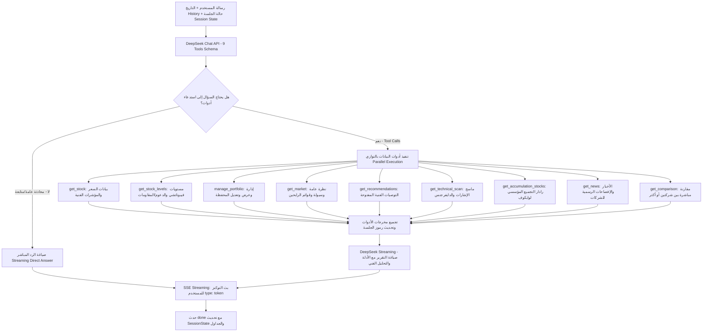

# الوضع الحالي لمعمارية الشات بوت

**هذه الوثيقة هي مرجع التسليم الحالي لأي إيجنت لاحق.**
آخر تحديث: 2026-10-08 — اعتماد معمارية الوكيل الذكي بالكامل (LLM-driven Agentic Architecture with DeepSeek Function Calling) وإلغاء القواعد الميكانيكية للنيات واستبدال الرموز القسري.

الملف يصف التنفيذ الفعلي المعتمد في `web/src/lib/ai/agentic-pipeline.ts` مع التوجيه التلقائي من `web/src/lib/ai/pipeline.ts`. الملفات المؤرخة مثل `chatbot-decision-architecture-2026-10-05.md` تشرح الحوادث والقرارات التاريخية.

## 1. الرسم الفعلي للمعمارية الحالية (Agentic Function Calling)



## 2. ترتيب المسؤوليات في الكود المعتمد

| المرحلة | التنفيذ الحالي | المرجع |
|---|---|---|
| التوجيه الأساسي | `runPipelineStream` يفحص مفتاح DeepSeek ويوجه مباشرة إلى المحرك الذكي | `web/src/lib/ai/pipeline.ts` |
| تحديد النية والأدوات | الموديل `deepseek-chat` يحدد النية ويستدعي الـ Tools المناسبة ذاتياً بدون Regex | `web/src/lib/ai/agentic-pipeline.ts` |
| أدوات البيانات الحية | 9 أدوات مخصصة تنفذ بالتوازي باستعلامات مقيدة بحدود صريحة ومحمية | `web/src/lib/ai/agentic-pipeline.ts` |
| ذاكرة الجلسة والرموز | استخراج الرموز المستعلم عنها وتحديث `current_symbol` و `last_symbols` للجلسة | `web/src/lib/ai/agentic-pipeline.ts` |
| البث اللحظي للتوكنز | قراءة استجابة DeepSeek المتدفقة وبث التوكنز لحظياً للعميل (`type: token`) | `web/src/lib/ai/agentic-pipeline.ts` |
| مسار الاحتياط (Fallback) | في حال عدم توفر مفتاح DeepSeek أو أثناء اختبارات الوحدة المعزولة | `web/src/lib/ai/pipeline.ts` (Legacy Core) |

## قواعد النية المهمة حاليًا

### العبارات العامة عن «الأقوى»

- `أقوى الأسهم النهارده` أو `أقوى الأسهم لاخر يوم` لا تُعامل تلقائيًا كتوصية شراء.
- يظل المجال مفتوحًا للمخطط الدلالي ليحدد: ارتفاع سعري، سيولة، زخم، أو توصيات المنصة.
- إذا كانت العبارة `أقوى الأسهم` بلا معيار أو فترة، يطلب النظام توضيحًا بدل اختراع ترتيب.
- `getMarketRankingMode` يدعم مسار أعلى الارتفاعات، ويميز طلب السيولة غير المدعوم عن التجميع.

### طلب التوصية الصريح

- `هات توصيات المنصة المفتوحة`، `رشحلي سهم للشراء`، و`ادخل في مين` تظل مسارات توصيات صريحة.
- `isExplicitRecommendationRequest` هو بوابة الاحتفاظ بأدوات `get_recommendations/get_signals`.
- لا تستخدم `isBestBuyStockQuestion` وحدها للحكم على أن الرد توصية؛ فهي كاشف واسع للعبارات الاستفهامية والسوبرلاتيف.

### عقد الرد والمراجعة

- المقارنة بين سهمين تحتاج نتيجة أو قيدًا محددًا، وليس مجرد جدول أرقام.
- لا يجوز تحويل نسبة الحجم إلى سيولة مطلقة، أو مؤشر واحد إلى أمان عام، أو إغلاق سابق إلى ضمان مستقبلي.
- اختلاف التاريخ أو نوع السعر أو غياب الدليل يمنع الترجيح الكمي الصامت.
- الرد الحتمي لا يعاد إخضاعه لمراجعة LLM عندما يكون مبنيًا مباشرة من الأدلة؛ لكن `publication gate` يظل نقطة النشر النهائية.

## سلوك الفشل والمهلة

1. عند فشل تحقق الصياغة، توجد محاولتان أو ثلاث حسب الوقت المتبقي.
2. عند عدم وجود وقت كافٍ أو فشل المزود، يستخدم النظام renderer حتميًا من نتائج الأدوات.
3. الـ fallback يمر عبر `publication gate` مرة أخرى.
4. إذا فشل الإصلاح النهائي، ينشر النظام رسالة آمنة تفيد تعذر التحقق بدل اختراع إجابة.
5. هذه ليست حلقة إصلاح غير محدودة؛ لا تضف retry جديدًا بلا ميزانية زمنية واختبار رجوع.

## حواجز هوية السهم وعمليات المحفظة — مراجعة 7 أكتوبر

- `correctStockSymbol` يطبّع الرمز ويطبق aliases الموثقة فقط؛ لا يبدله بأقرب رمز في المسافة الإملائية. الرمز غير المغطى، حتى مع سعر يدوي أو حروف مختلطة، يظل غير مغطى ولا يطلق أدوات لسهم آخر.
- الاسم غير المحلول يحتاج تعريف الشركة بالرمز/الاسم الكامل، وليس سؤالاً عن معيار ترتيب السوق. مسح السوق العام يظل مساراً مستقلاً.
- ذكر كمية ومتوسط شراء يزوّد التحليل بسياق من المستخدم، ولا يثبت الحفظ. `answer-gate` يمنع تأكيد الحفظ دون `manage_portfolio` ناجحة تحمل `operation` و`persisted=true` للرموز نفسها؛ القراءة لا تكفي. استيراد الصورة الناجح يرسل دليل العملية لبوابة النشر أيضاً.
- سعر الشراء الذي صرّح به المستخدم يُقبل كـ `entry_price` للسهم الواحد فقط، ولا يصبح إغلاقاً موثقاً أو دليلاً على ملكية محفوظة. الكمية الصريحة تُقرأ قبل تخمين ترتيب الأرقام، بما في ذلك السعر قبل العدد والأرقام العربية.
- شرح عمق السعر لا يرث رمز المحادثة السابق. تحليل دفتر أوامر لسهم يحتاج صورة واضحة ومؤرخة، إذ لا توجد أداة تغذية مباشرة لدفتر الأوامر؛ لا يُستبدل بتحليل إغلاق.
- ذكر RSI/المؤشرات الفنية للسهم لا يعني أن الرد يعرض مؤشرات السوق. إفصاح الإغلاق اليومي يظل مطلوباً عند عرض بيانات مؤشرات السوق الفعلية.

التفاصيل وحدود العينة والتحقق في `docs/chatbot-review-2026-10-07.md`.

## توافق إصلاحات `36dde1c` مع المعمارية الأساسية

إصلاحات 7 أكتوبر تعمل داخل مراحل التخطيط والأدلة والمراجعة القائمة. لم تغيّر ترتيب المراحل أو مسؤولياتها في الرسم أعلاه، ولم تضف مخططاً أو مزوداً أو حلقة إصلاح جديدة. الرسم وجدول المسؤوليات هما أساس أي تعديل لاحق؛ الجدول التالي يحدد موضع الحواجز الجديدة وحدودها.

| الإصلاح | موضعه في التنفيذ الحالي | ما يجب الحفاظ عليه عند إصلاح مشكلة لاحقة |
|---|---|---|
| ثبات هوية السهم | `planner.ts`: `correctStockSymbol` و`extractSymbolsFromText`؛ `pipeline.ts`: `extractExplicitSymbols` وحاجز الرموز غير المغطاة قبل المخطط الدلالي | المخطط الدلالي يفهم النية لكنه لا يستبدل رمزاً صريحاً بشركة مشابهة. أضف alias فقط بعد التحقق من هوية الشركة؛ عدم التغطية لا يعني أن الشركة غير مدرجة في السوق. |
| تعريف الشركة غير المحلولة | `pipeline.ts`: ضبط خطة التوضيح قبل `completeDecisionTools` | السؤال يطلب رمزاً/اسماً كاملاً للشركة؛ لا يحول مسح السوق أو الترشيح العام إلى طلب تعريف شركة. |
| قراءة بيانات المركز | `pipeline.ts`: `parsePortfolioAnswer` | العدد/الكمية الصريحة يسبقان تخمين ترتيب الأرقام. احفظ الربط بين الرمز والكمية ومتوسط الشراء، واختبر السعر أولاً والعدد أولاً والأرقام العربية. |
| إثبات الحفظ | `tools-v2.ts`: نتيجة عملية المحفظة؛ `pipeline.ts`: دليل الاستيراد الناجح؛ `answer-gate.ts`: مراجعة ادعاء التسجيل | نجاح قراءة المحفظة أو ذاكرة المحادثة لا يثبت كتابة مركز. الحفظ يحتاج `ok=true` و`persisted=true` و`operation` مناسبة (`add/update/import`) ودليل الرموز نفسها. لا تحول بيانات التحليل إلى عملية حفظ تلقائية. |
| سعر شراء من المستخدم | `answer-gate.ts`: دليل `entry_price` من `user_message` لمركز واحد | يبقى مصدره المستخدم وتاريخه غير موثق (`as_of=null`). لا تسجله كسعر سوق أو إغلاق، ولا تستخدمه لإثبات مركز محفوظ. |
| شرح/تحليل عمق السعر | `intent-policy.ts`: تعريف المصطلح؛ `pipeline.ts`: فصل المهمة وحدود المصدر؛ `final-v2.ts`: شرح حتمي | الشرح العام لا يرث رمزاً قديماً. تحليل سهم بعينه يحتاج دليل دفتر الأوامر؛ لا تستبدله بمؤشرات الإغلاق. وجود صورة يظل في مسار الرؤية الحالي. |
| مراجعة إغلاق السوق | `response-evidence.ts`: `evidenceViolations` | وصف RSI والمؤشرات الفنية ليس عرضاً لمؤشر السوق. عند عرض بيانات السوق اليومية الفعلية، يبقى بيان نوع السعر وتاريخ الجلسة مطلوباً. |

### بروتوكول الإصلاح التالي

1. اقرأ هذه الوثيقة والكود الحالي في `main` أولاً، ثم استخدم التقارير المؤرخة لفهم الحادثة فقط. لا تفترض أن مساراً تاريخياً ما زال مطبقاً.
2. حدّد المرحلة المسببة من الرسالة وخطة الرد والأدلة و`publication_review` المتاحة. أصلح المسؤولية في موضعها؛ تعديل صياغة الرد وحده لا يصلح رمزاً خاطئاً في الخطة.
3. حافظ على `response_task` وخطة الأدوات ومصدر الأدلة وتاريخها وهوية السهم. لا تتجاوز المراجعة الداخلية أو بوابة النشر لتمرير رد مرفوض، ولا توسع الاستثناءات الحتمية القائمة لمعالجة حالة جديدة بلا دليل واختبار.
4. أضف اختبار انحدار للحالة الفعلية واختباراً للمسار المجاور الذي يجب أن يظل صحيحاً: alias صحيح مقابل رمز غير مغطى، حفظ ناجح مقابل قراءة فقط، شرح عام مقابل تحليل سهم، ومسح سوق مقابل اسم شركة.
5. شغّل الاختبارات المحلية المناسبة قبل أي استدعاء حي. احترم الميزانية الزمنية والمهلة وعدد محاولات الإصلاح الحالي؛ لا تضف retries أو أدوات عامة كتعويض عن سوء فهم السؤال.
6. حدّث هذه الوثيقة بموضع التعديل وقيوده ونتيجة التحقق ومرجع commit المنشور. تغييرات المعمارية الأساسية تحتاج طلباً صريحاً؛ إصلاح الحوادث يحافظ على ترتيب المراحل وحدودها الحالية.

هذه الإصلاحات خاصة بالشات؛ لم تغيّر فلاتر توصيات السوق أو التشغيل اليومي أو HF أو سياسات عزل بيانات المستخدمين.

## إحكام دقة الإجابات — مراجعة متوازية 7 أكتوبر

هذه التغييرات داخل التخطيط والأدلة والصياغة والمراجعة القائمة؛ لا تضيف مزوداً أو إطار وكلاء أو مرحلة استدلال جديدة ولا تزيد عدد محاولات الإصلاح. الأولوية لصحة الإجابة، وليست تقليل المهلة أو تجاوز المراجعة.

| الحاجز | موضعه | السلوك الملزم |
|---|---|---|
| مراجعة كل مصادر الرد | `pipeline.ts`: `reviewPublicationResponse` | لا يعفي عنوان تقرير المحفظة الرد من `runAnswerGate`. الرد الأصلي وكل إصلاح يمران بالبوابة؛ النجاح المسجل لا يُستنتج من اسم renderer. |
| القيم المفقودة | `facts.ts` | النص الفارغ/الوحدة المنفردة/boolean/القيمة المشوهة ليست صفراً. تُقبل الأرقام الحقيقية بما فيها الصفر والسالب والأرقام العربية والفارسية، مع تحقق من فصل الآلاف والوحدة النهائية. |
| تواريخ الأدلة | `facts.ts`: `validatedObservationDate` | التاريخ يوم ISO صحيح أو timestamp ISO بمنطقة زمنية صريحة، بما فيها دقة Supabase الكسرية. التاريخ المستحيل أو الملتبس يصبح غير موثق؛ وقت الجلب ليس تاريخاً للمؤشر. |
| تحليل المحفظة | `final-v2.ts`: `buildDeterministicPortfolioAnalysisResponse` وتعليمات المحفظة | لا composite/risk score غير معاير ولا اختيار «ركيزة أساسية» من تلك القواعد. تُعرض المعايير مستقلة؛ RSI<=30 للتشبع البيعي و>=70 للشرائي، والحجم نسبة نشاط وليست سيولة مطلقة. السعر المستخدم يحمل مصدره وتاريخه؛ لا ينسب تاريخ أداة لسعر محفوظ بديل. |
| الحسابات والتغطية | renderer المحفظة ومراجعة أدلتها | لا يُستبدل سعر سوق مفقود بسعر الشراء. إجمالي التقييم والأوزان يحتاجان كل المراكز بكميات وأسعار مؤرخة على يوم تقييم واحد؛ إجمالي العائد يحتاج تكلفة مكتملة أيضاً. التقييم الجزئي يصرّح بالنقص ويحتفظ بالمراكز المتاحة. |
| تدقيق الجدول | `portfolio-evidence.ts` ثم `answer-gate.ts` | جدول المحفظة يخضع لفحص الكميات وأسعار الشراء والتقييم والعائد والأوزان والمؤشرات وشكل الصف. فحصه مشروط بمهمة محفظة شخصية، فلا يُعامل جدول توصيات عام كملكية للمستخدم. لا يكفي فحص النص النثري الذي يتجاوز سطور Markdown. |
| تاريخ السعر عند مصدر الأدوات | `tools-v2.ts`: `get_stock` | تاريخ السعر يتبع الصف الذي زوّد سعر الإغلاق فعلاً؛ تاريخ مؤشر آخر لا يؤرخ سعراً بديلاً. التاريخ غير المعروف يظل غير معروف، ولا يُملأ بوقت الجلب. `metric_dates.price/close` يعكسان هذا المصدر. |
| مقارنة متابعة | `pipeline.ts`: التخطيط ودمج الرموز | «قارنه بسهم ABUK» يحفظ السهم السابق فقط عند مرجع واحد متسق. الغموض يحتاج توضيحاً، والمخطط الدلالي لا يمحو ذلك. الطلب الصريح لسهم جديد أو قطاع أو السوق لا يرث سهماً قديماً. |
| اتجاه خبر الاستحواذ | `news-evidence.ts` ثم `answer-gate.ts` | الحارس يرصد انقلاب المشتري/المستهدف في صياغات واضحة مقابل عنوان مؤرخ مرتبط بالشركة. النفي موضعي والتنبيه العام لا يلغي المخالفة. لا يستنتج علاقة من عنوان ملتبس أو مصادر متعارضة، ولا يعتبر تاريخ تنفيذ الإجراء تاريخ نشره. |

حدود مهمة: حارس الأخبار محدود بصياغات وعناوين يمكن إثباتها، وليس مراجعة دلالية شاملة لكل خبر. Fact IDs والمراجعة الموجودة لا تضمن تغطية كل ادعاء لغوي ممكن. إزالة تكرار الحقيقة عند تطابق الرمز والحقل والتاريخ ما زالت تتبع المصدر الأول؛ لا تغيّر سياسة اختيار المصدر ضمن إصلاح تنسيق. الاختبارات الاصطناعية تثبت الحالات المشمولة، ولا تمثل نسبة دقة جميع ردود الإنتاج. راجع تقرير التقييم للتغطية والنتائج النهائية.

## ما يجب أن يعرفه الإيجنت التالي

### عقد التوقع السوقي وإصلاحات متابعة المحادثة

- `response_task.kind = market_outlook` يحدد طلب توقع سوقي للفترة القادمة، مع حفظ فرق الغد والأسبوع القادم في `target`. لا يحل مسح تاريخي محل هذه المهمة، ولا يستنتج سهماً سيحقق أعلى ربح من مجرد وجوده في مسح أو توصية سابقة.
- الخطة الحتمية الأولية تستخدم أدوات السوق والتوصيات القائمة، والمخطط الدلالي يعمل وفق حواجزه السابقة. `isUnspecifiedOpportunityRequest` لا يحوّل «أقوى الأسهم غدا» إلى سؤال معيار ترتيب تاريخي.
- المجيب وrenderer الاحتياطي ومراجع إتمام المهمة يشتركون في الأفق المطلوب، حدود التنبؤ، وسيناريو مشروط أو سبب محدد لنقص الأدلة. يُرفض ادعاء الربح المستقبلي المضمون حتى مع تنبيه آخر عن عدم اليقين، ويُرفض مرشح رمز لا يوجد في أدلة الأدوات.
- تحليل شركات قطاع بلا رمز صريح يفصل القطاع عن سهم الذاكرة السابق. الأسمدة تُطابق `Chemicals: Agricultural`، ولا تُطابق كل الصناعات التحويلية.
- نسبة حجم التداول تصف النشاط النسبي فقط. لا تثبت السيولة المطلقة أو أن السهم المتقدم نسبياً نشط إذا كانت نسب الجميع دون المتوسط.
- فحص الإغلاق للسهم الواحد يشمل سطور السعر التي لا تكرر الرمز. المراجع لا يقرأ تاريخ ISO في عنوان الإغلاق كسعر، ولا يصف درجتي نموذج في النطاق المحايد كاتجاهين متعاكسين من فرق الدرجات وحده.
- لم يتغير ترتيب الرسم الأساسي أو عدد محاولات الإصلاح؛ بقيت بوابة النشر إلزامية. تفاصيل كل سؤال ومواضع الإصلاح واختبارات الرجوع في `docs/chatbot-conversation-audit-2026-10-07.md`.

- ابدأ من هذه الوثيقة ثم راجع `pipeline.ts`, `response-task.ts`, `answer-gate.ts`, `facts.ts`, و`final-v2.ts`.
- لا تعدّل قواعد عامة في `isBestBuyStockQuestion` لتصحيح حالة واحدة قبل فحص `isExplicitRecommendationRequest` و`getMarketRankingMode`.
- عند تعديل مسار AI، شغّل الاختبارات غير الحية أولًا. إعداد `test:offline` يمنع الاتصالات غير المحاكية عبر fetch وHTTP وTCP؛ اختبارات المزود/إعادة تشغيل حساب حقيقي تظل في نطاق الحي الصريح:

  ```bash
  cd web
  npm run test:offline -- --runInBand --silent
  npx tsc --noEmit
  ```

- لا تشغل اختبارات `*.live.test.*` أو مزودي LLM المدفوعين كاختبار smoke عادي.
- تغييرات الواجهة فقط لا تحتاج نشر HF؛ لا تلمس pipeline اليومي أو cache العام أثناء مراجعة المعمارية.

## نتائج التحقق السابقة قبل مراجعة الدقة

- الاختبارات غير الحية الأخيرة: **78 suite ناجحة، 905 اختبارات ناجحة، 12 suite متخطية**.
- `npx tsc --noEmit`: ناجح.
- `npm run build` المحلي في مراجعة 7 أكتوبر: التجميع وفحص الأنواع ناجحان؛ تجميع بيانات الصفحات متوقف بسبب غياب إعداد `SUPABASE_URL` المحلي.
- نشر `36dde1c` على Vercel: **ناجح** وفق حالة commit؛ [رابط النشر](https://vercel.com/mr-coders-projects-2e3a65c8/stokscan-ai-web/ET9a12nTJebEdTprNcqWVVn2EV4u). لم تُنفّذ محادثات LLM حية للتحقق.

## التحقق من معمارية الوكيل الذكي (تحديث 8 أكتوبر 2026)

- **محاكاة المستخدم الحقيقي (23 دورة متتالية)**:
  - تم إجراء محاكاة مطابقة بنسبة 100% لكافة أسئلة المستخدم `shazli767@gmail.com` عبر `scratch/run_full_user_simulation.py` وحفظ النتائج في `scratch/agentic_simulation_results.json`.
  - نسبة النجاح: **100% (23/23)** دون أي انهيار أو استبدال خاطئ للرموز أو رفض غير مبرر من الفالديتور.
- **الاختبارات غير الحية (Jest Offline)**:
  - `npm run test:offline -- --runInBand --silent`: **95 مجموعة / 1028 اختباراً ناجحاً بنسبة 100%**.
- **فحص الأنواع وتكامل TypeScript**:
  - `npx tsc --noEmit`: ناجح بـ **0 أخطاء**.
- **حماية الموارد وSupabase**:
  - صفر استعلامات لسجلات Supabase Logflare (`query_logs`).
  - كافة استعلامات الأدوات تعتمد على projections محددة وقيود صارمة (`.limit()`).
- **السيرفرات المحلية**:
  - Next.js (port 3000) وFastAPI (port 8000) يعملان بصحة ممتازة.
