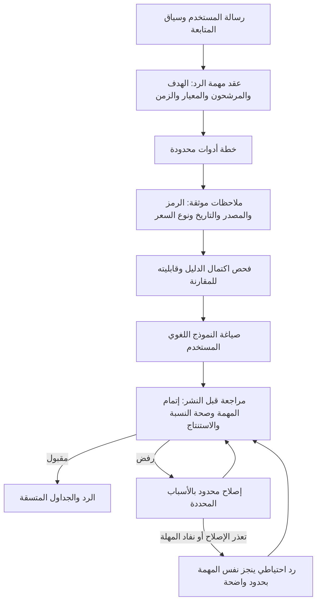

# إصلاح مفاضلة الشات بوت — 5 أكتوبر 2026

## الواقعة والأدلة

في 05:19 صباحاً بتوقيت القاهرة سأل مستخدم: «أيهما أفضل للمضاربة يوم الإثنين gbco أو alcn». الرد عرض أسعاراً وRSI ونسبة حجم، لكنه لم يشرح المفاضلة أو ما يمنع حسمها. بيانات النشر سجلت نجاح المراجعة. السؤال كان واضحاً ويحدد السهمين والأفق؛ طلب توضيح إضافي لم يكن علاجاً مناسباً.

الرد يطابق مسار المقارنة الاحتياطي العام في الكود. بيانات الرسالة القديمة لا تثبت سبب اللجوء إليه أو حدوث عطل لدى مزود النموذج. لا يصح نسبة الواقعة إلى المزود دون دليل.

ظهرت عيوب مرتبطة:

- جدول المقارنة عرض نسبة الحجم صفراً رغم وجود 1.94x و3.12x في نتائج السهمين؛ اختلاف أسماء الحقول وتحويل الغياب إلى صفر شوه العرض.
- خبر عن شركة «سيد» ظهر تحت GBCO؛ وسم التخزين لم يثبت هوية الشركة في العنوان.
- مصفوفة المقارنة القديمة صنعت درجات تجميعية وفائزاً من قواعد غير معايرة، وتضمنت وصف فروق بأنها إحصائية دون اختبار.
- تعليمات الصياغة فرضت تقريراً طويلاً ومصفوفة شراء حتى عندما يطلب المستخدم مفاضلة قصيرة. بعض قواعد الحجم ناقضت التمييز بين النشاط النسبي والسيولة المطلقة.
- المراجعة اهتمت بالتغطية الرقمية ولم تفرض إتمام مهمة الاختيار. لذلك نجحت إجابة صحيحة الأرقام وضعيفة الفائدة.

## الهيكلة الأنسب لهذا النظام

الاختيار المعماري هنا استنتاج هندسي من الأدلة والدراسات؛ ليس ضماناً منشوراً لانعدام الأخطاء.

### ما نُفذ

1. **عقد واحد لهدف الرد:** أضفنا `response_task` مستقلاً عن اسم الأداة، و`answer_kind` إلى طلب المخطط. المفاضلة تُستنتج من السؤال والعقد الدلالي، وتستبقي معيار إجابة متابعة قصيرة في السياق المناسب. تستخدم الخطة والمجيب والاحتياطي والمراجع الهدف نفسه.
2. **استكمال الأدوات:** المفاضلة تتطلب بيانات المرشحين والمقارنة، وتضيف المستويات عند المضاربة أو المخاطرة. يحافظ المسار على حدود التوضيح والمعاملات القائمة.
3. **دليل قابل للمقارنة:** أسعار ومؤشرات لكل المرشحين؛ تواريخ مستقلة للمؤشرات؛ تمييز السعر اللحظي والإغلاق. اختلاف التاريخ أو نوع السعر أو غياب البيانات يمنع ترجيحاً كمياً صامتاً. نافذة السبعة أيام التقويمية حد تحفظي لطلبات الوقت الحالي، وليست تقويماً لجلسات البورصة. الطلب التاريخي يتطلب تاريخاً مطابقاً.
4. **مفاضلة لكل معيار:** حجم نسبي أعلى، امتداد RSI أقل، تغير مسجل أعلى. لا يتحول أي منها وحده إلى سيولة مطلقة أو أمان عام أو ضمان عائد. أزلنا جمع المؤشرات إلى درجة شراء والفروق الإحصائية المصطنعة.
5. **صياغة مختصرة:** خلاصة مشروطة ثم دليل كل مرشح وتاريخ السعر وحدود التنفيذ؛ تقرير مفصل عند طلب التفاصيل. أزلنا تعليمات المقارنة المتعارضة، وعتبات التنفيذ العامة غير الموثقة.
6. **مراجعة إتمام المهمة:** القائمة الرقمية وحدها تُرفض عندما يطلب المستخدم اختياراً. تُفحص التغطية والتفسير والشرط المستقبلي والأفضلية المدعومة وإنكار درجات نموذج موجودة ومدة انتظار تنفيذ مخترعة. ربط العبارات يأخذ قسم السهم في الاعتبار؛ «أقل من GBCO» داخل قسم ALCN لا تنسب رقم ALCN إلى GBCO.
7. **احتياطي مفيد:** إذا تعذر النموذج أو فشل الإصلاح، يشرح الاحتياطي نفس المفاضلة باستخدام الأدلة المتاحة، أو يحدد المعلومة الناقصة. الرد الطبيعي يظل من النموذج المهيأ؛ الاحتياطي مسجل صراحة كمصدر مختلف.
8. **مصدر الرد:** يسجل مسار البث `response_origin` و`response_task`، ويميز الرد الاحتياطي في نوع الرسالة. أضفنا مصدر fallback في مسارات الخطأ أيضاً.
9. **عرض متسق:** جدول المقارنة يقرأ أسماء حقول الحجم الصحيحة وصفوف المقارنة المعتمدة. الغياب يظهر فارغاً؛ الصفر الحقيقي يبقى صفراً.
10. **أحداث الشركات:** قراءة الأخبار المخزنة تفحص هوية الشركة في العنوان باستخدام رموز وأسماء معروفة غير ملتبسة. لم تُحذف سجلات قديمة؛ تمنع القراءة نشر الخبر غير المطابق. لا تضيف هذه الخطوة طلب قاعدة بيانات جديداً.

### لماذا هذه البنية؟

| المصدر الأصلي | ما يدعمه | التطبيق هنا |
|---|---|---|
| [Building effective agents](https://www.anthropic.com/engineering/building-effective-agents) | مسارات بسيطة قابلة للتركيب ومقاييس واضحة للمراجع | عقد مهمة ومسار إصلاح محدود بدلاً من إضافة وكلاء إلى كل رسالة |
| [Context engineering](https://www.anthropic.com/engineering/effective-context-engineering-for-ai-agents) و[Lost in the Middle](https://arxiv.org/abs/2307.03172) | جودة وانتقاء السياق أهم من مجرد زيادة طوله؛ موضع المعلومات قد يؤثر في استخدامها | حزمة مركزة لهدف المفاضلة ودليلها، وإزالة التعليمات المتعارضة |
| [LLMs Cannot Self-Correct Reasoning Yet](https://arxiv.org/abs/2310.01798) | المراجعة الذاتية بلا تغذية خارجية ليست أساساً موثوقاً لإصلاح التفكير | المراجع يقارن بالمهمة والأدلة، وليس بانطباعه عن بلاغة الرد |
| [τ-bench](https://arxiv.org/abs/2406.12045) و[BFCL](https://gorilla.cs.berkeley.edu/leaderboard.html) | ضرورة تقييم الأدوات والمحادثات متعددة الأدوار والنتيجة النهائية | اختبارات متابعة قصيرة وفشل أدوات ومزود وتغطية المرشحين، وليس تصنيف النية فقط |
| [Demystifying agent evals](https://www.anthropic.com/engineering/demystifying-evals-for-ai-agents) | الجمع بين اختبارات برمجية ومراجعة النموذج والبشر، والتمييز بين المسار والنتيجة | حفظ الواقعة كاختبار رجوع ومراجعة مستقلة؛ نجاح المراجع ليس ضمان صحة عامة |
| [Clarifying questions via future turns](https://arxiv.org/abs/2410.13788) | تقييم التوضيح بما يحسنه في الأدوار التالية | ربط إجابة معيار قصيرة بالسؤال السابق، وعدم تكرار سؤال محسوم |
| [CRAG](https://arxiv.org/abs/2401.15884) | فحص جودة وصلة الاسترجاع | فحص هوية الشركة في الخبر؛ وجود سجل مخزن لا يكفي |

هذه مراجعة مركزة لمصادر أصلية ذات صلة، وليست مسحاً لكل الأنظمة أو إثباتاً لتفوق النظام على جميع الشات بوتات.

## التحقق وحدود النتائج

- رفضنا الرد الأصلي في اختبار رجوع بسبب عدم إتمام المفاضلة.
- اختبرنا تغيير ترتيب الأدوات، غياب سعر أو تاريخ، مؤشرات بتاريخ آخر، بيانات قديمة، خلط لحظي وإغلاق، تعادل المؤشرات، الصفر الحقيقي، بيانات تاريخية محددة، ترجيح مخالف للدليل، متابعة قصيرة، وفشل المزود والإصلاح.
- اختبرنا ظهور الجدول الصحيح ورفض خبر «سيد» تحت GBCO.
- أُجري **استدعاء نموذج فعلي واحد** على ملاحظات الواقعة المحفوظة، دون جلسة مستخدم أو كتابة قاعدة بيانات: DeepSeek Chat، 6,547 مللي ثانية، 8,187 توكن إدخال و1,203 إخراج، الإجمالي 9,390.
- الاستدعاء كشف خطأ نسبة في المراجع؛ ثم كشف المراجع المستقل مدة انتظار 15–30 دقيقة غير موثقة في الرد. احتفظنا بالرد والمدخل الفعلي كعينة تشخيصية، لا كإجابة مثالية. الفحص الجديد يرفض التوقيت، ويقبل إعادة التشغيل المحفوظة بعد حذف شرط التوقيت؛ لم نكرر الاستدعاء المدفوع.
- تغييرات الاختصار جاءت بعد الاستدعاء؛ لم نقس توفير التوكن بعد التغيير، ولا ننسب نسبة توفير تقديرية كأنها قياس.

التحقق النهائي: **13 مجموعة اختبارات محلية ذات صلة / 140 اختباراً ناجحاً**، و`npm run build` النهائي انتهى بنجاح (exit 0) بعد فحص الأنواع وتجهيز 62 صفحة. توجد تحذيرات إعداد i18n وتعدد ملفات القفل ومسارات ديناميكية وغياب بعض بيانات السوق في بيئة البناء؛ نجاح البناء ليس اختباراً لوصول بيانات السوق الحية. المراجع المستقل رجع **PASS** بعد مراجعة الإصلاحات والعينة الفعلية والتقرير. حالة النشر تُعلن مع معرف الالتزام بعد التحقق منها.

## حدود التنفيذ وما يلي

العقد الإلزامي الجديد يغطي عائلة **المفاضلة بين الأسهم**؛ تسميات explanation/fact لا تعني تطبيق مراجع دلالي شامل لهما. تعتمد بعض الفحوص اللغوية على أنماط، ويمكن أن يفلت إعادة تعبير جديدة. بعض فحوص الأرقام تتجاوز الجمل المختلطة متعددة الأسهم أو الجداول، لذلك النجاح الحالي ليس برهاناً على كل ادعاء.

تحسين معماري تالٍ قابل للقياس: تعميم عقود إتمام المهمة لكل عائلات الطلبات، فصل حالة الحوار عن ملخص نصي، ثم توليد مرشح منظم يربط كل ادعاء بمعرف حقيقة وتوليد الجداول من الحقائق مباشرة. يُضاف مراجع دلالي عند الحالات التي لا تحسمها الفحوص البرمجية، بحزمة الهدف والسياق والدليل نفسها وميزانية محددة. لا يلزم تشغيل عدة نماذج مدفوعة في كل رسالة.

قبل توسيع المسار: بناء مجموعة محادثات مجهولة متعددة الأدوار ومعايير نجاح بشرية، وقياس فائدة الإجابة، صحة الأداة، صحة الادعاء، قبول/رفض المراجع الخاطئ، معدل الاحتياطي، زمن الرد وتكلفته. اختبار اختلاف الصياغة وتكرار المحاولة أهم من نجاح مثال واحد. لا توجد بنية علمية تضمن «لن يخطئ أبداً»؛ الهدف منع أنماط الفشل المعلومة وكشف الجديدة واحتواؤها.
